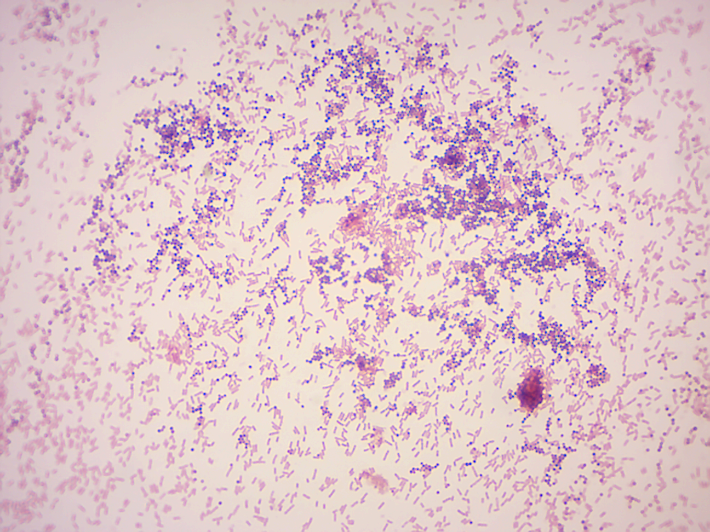
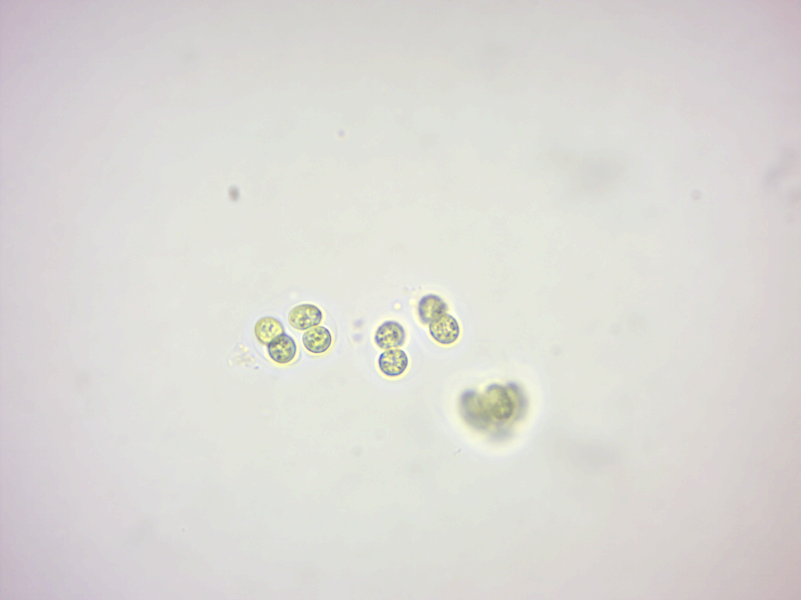
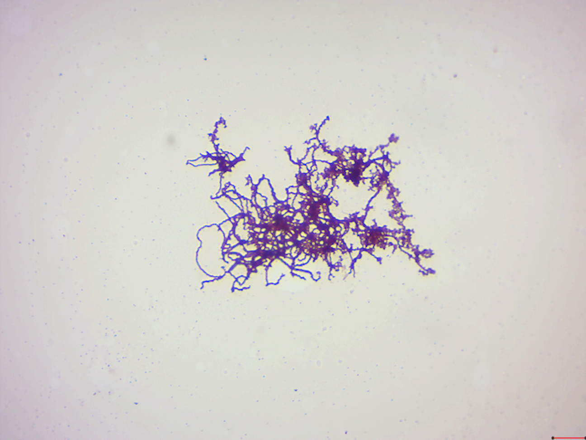

# Archaea and Bacteria

In biological [taxonomy](https://en.wikipedia.org/wiki/Taxonomy_(biology)), a domain is the highest taxonomic rank of organisms in the [three-domain system](https://en.wikipedia.org/wiki/Three-domain_system) of taxonomy designed by Carl Woese, an American microbiologist and biophysicist. According to the Woese system, introduced in 1990, the tree of life consists of three domains: Archaea, Bacteria, and Eukarya. The first two are all prokaryotic microorganisms, or single-celled organisms whose cells have no nucleus. All life that has a nucleus and membrane-bound organelles, and multicellular organisms, is included in the Eukarya.

## Bacteria
[Bacteria](https://en.wikipedia.org/wiki/Bacteria) (singular: bacterium) are prokaryotic microorganisms. Typically, a few micrometers in length, bacteria have a number of shapes, ranging from spheres to rods and spirals. Bacteria were among the first life forms to appear on Earth, and are present in most of its habitats. Bacteria inhabit soil, water, acidic hot springs, radioactive waste, and the deep portions of Earth's crust. Bacteria also live in symbiotic and parasitic relationships with plants and animals. Most bacteria have not been characterized, and only about half of the bacterial phyla have species that can be grown in the laboratory. The study of bacteria is known as bacteriology, a branch of microbiology.
There are typically 40 million bacterial cells in a gram of soil and a million bacterial cells in a milliliter of fresh water. There are approximately 5x10^30^ bacteria on Earth forming a biomass which exceeds that of all plants and animals. Bacteria are vital in many stages of the nutrient cycle by recycling nutrients such as the fixation of nitrogen from the atmosphere. The nutrient cycle includes the decomposition of dead bodies and bacteria are responsible for the putrefaction stage in this process. In the biological communities surrounding hydrothermal vents and cold seeps, extremophile bacteria provide the nutrients needed to sustain life by converting dissolved compounds, such as hydrogen sulfide and methane, to energy. In March 2013, data reported by researchers in October 2012, was published. It was suggested that bacteria thrive in the Mariana Trench, which with a depth of up to 11 kilometers is the deepest known part of the oceans. Other researchers reported related studies that microbes thrive inside rocks up to 580 meters below the sea floor under 2.6 kilometers of ocean off the coast of the northwestern United States.
The largest number of bacteria in humans exist in the gut flora, and a large number on the skin. The vast majority of the bacteria in the body are rendered harmless by the protective effects of the immune system, though many are beneficial particularly in the gut flora. However, several species of bacteria are pathogenic and cause infectious diseases. The most common fatal bacterial diseases are respiratory infections, with tuberculosis alone killing about 2 million people per year, mostly in sub-Saharan Africa. In developed countries, antibiotics are used to treat bacterial infections and are also used in farming, making antibiotic resistance a growing problem. In industry, bacteria are important in sewage treatment and the breakdown of oil spills, the production of cheese and yogurt through fermentation, and the recovery of gold, palladium, copper and other metals in the mining sector, as well as in biotechnology, and the manufacture of antibiotics and other chemicals.

## Archaea
[Archaea](https://en.wikipedia.org/wiki/Archaea) have unique properties separating them from the other two domains of life, Bacteria and Eukaryota. The Archaea are further divided into multiple recognized phyla. Classification is difficult because the majority have not been isolated in the laboratory and have only been detected by analysis of their nucleic acids in samples from their environment.
Archaea and bacteria are generally similar in size and shape, although a few archaea have very strange shapes. Despite this morphological similarity to bacteria, archaea possess genes and several metabolic pathways that are more closely related to those of eukaryotes, notably the enzymes involved in transcription and translation. Other aspects of archaeal biochemistry are unique, such as their reliance on ether lipids in their cell membranes. Archaea use more energy sources than eukaryotes: these range from organic compounds, such as sugars, to ammonia, metal ions or even hydrogen gas. Salt-tolerant archaea use sunlight as an energy source, and other species of archaea fix carbon; however, unlike plants and cyanobacteria, no known species of archaea does both. Archaea reproduce asexually by binary fission, fragmentation, or budding; unlike bacteria and eukaryotes, no known species forms spores.
Archaea were initially viewed as extremophiles living in harsh environments, such as hot springs and salt lakes, but they have since been found in a broad range of habitats, including soils, oceans, and marshlands. They are also part of the human microbiota, found in the colon, oral cavity, and skin. Archaea are particularly numerous in the oceans, and the archaea in plankton may be one of the most abundant groups of organisms on the planet. Archaea are a major part of Earth's life and may play roles in both the carbon cycle and the nitrogen cycle. No clear examples of archaeal pathogens or parasites are known, but they are often mutualists or commensals. One example is the methanogens that inhabit human and ruminant guts, where their vast numbers aid digestion. Methanogens are also used in biogas production and sewage treatment, and biotechnology exploits enzymes from extremophile archaea that can endure high temperatures and organic solvents.

## Eukarya
Members of the domain Eukarya are called [eukaryotes](https://en.wikipedia.org/wiki/Eukaryote). A eukaryote is any organism whose cells have a cell nucleus and other organelles enclosed within membranes) can be unicellular or multicellular organisms. The defining feature that sets eukaryotic cells apart from prokaryotic cells (Bacteria and Archaea) is that they have membrane-bound organelles, especially the nucleus, which contains the genetic material enclosed by the nuclear membrane. The presence of a nucleus gives eukaryotes their name, which comes from the Greek eu, "well" or "true" and karyon, "nut" or "kernel". Eukaryotic cells also contain other membrane-bound organelles such as mitochondria, endoplasmic reticulum and the Golgi apparatus. In addition, plants and algae contain chloroplasts. Unlike unicellular archaea and bacteria, eukaryotes may also be multicellular and include organisms consisting of many kinds of tissue and cell types.
Eukaryotes can reproduce both asexually through mitosis and sexually through meiosis and gamete fusion. In mitosis, one cell divides to produce two genetically identical cells. In meiosis, DNA replication is followed by two rounds of cell division to produce four haploid daughter cells. These act as sex cells (gametes). Each gamete has just one set of chromosomes, each a unique mix of the corresponding pair of parental chromosomes resulting from genetic recombination during meiosis.
Eukaryotes evolved approximately 1.6-2.1 billion years ago, during the Proterozoic eon.

[Viruses](https://en.wikipedia.org/wiki/Virus) are not part of the three-domain system.

##  Gram stain
[Gram stain](https://en.wikipedia.org/wiki/Gram_stain) or Gram staining (Figure \@ref(fig:gram)), also called Gram's method, is a method of staining used to distinguish and classify bacterial species into two large groups (gram-positive and gram-negative). The name comes from the Danish bacteriologist Hans Christian Gram, who developed the technique.

Gram staining differentiates bacteria by the chemical and physical properties of their cell walls by detecting peptidoglycan, which is present in the cell wall of Gram-positive bacteria. Gram-negative cells also contain peptidoglycan, but a very small layer of it that is dissolved when the alcohol is added. This is why the cell loses its initial color from the primary stain. Gram-positive bacteria retain the crystal violet dye, and thus are stained violet, while the Gram-negative bacteria do not; after washing, a counterstain is added (safranin) that will stain these Gram-negative bacteria a pink color. Both Gram-positive bacteria and Gram-negative bacteria pick up the counterstain. The counterstain, however, is unseen on Gram-positive bacteria because of the darker crystal violet stain.

```{r gram, fig.cap='Gram stained bacteria.', echo=FALSE, message=FALSE, warning=FALSE}

```

### Experimental procedures
1.	Use a bacterial loop to pick up bacteria (Staphylococcus aureus and Escherichia coli) from the culture plate and streak out on a slide so that both samples partially overlap in the middle of the slide. Heat fix the sample to the slide by carefully passing the slide three times through a Bunsen burner flame.
2.	Add crystal violet to the slide and incubate for 1 minute. Rinse slide with a gentle stream of water to remove unbound crystal violet.
3.	Add Gram's iodine for 1 minute- this is the mordant, an agent that fixes the crystal violet to the bacterial cell wall.
4.	Rinse slide with decolorizer until no more dye is running off. Rinse with a gentle stream of water.
5.	Add safranin to the slide and incubate for 1 minute. Wash with a gentle stream of water. Gram positive bacteria it will retain crystal violet and stain purple. Gram negative will lose the primary stain and take the secondary stain causing it to appear pink when viewed under a microscope.
6.	View under the microscope.

##  View living organisms
### Oscillatoria
[*Oscillatoria*](https://en.wikipedia.org/wiki/Oscillatoria) is a genus of filamentous cyanobacterium which is named after the oscillation in its movement. Filaments in the colonies can slide back and forth against each other until the whole mass is reoriented to its light source. It is commonly found in watering-troughs waters, and is mainly blue-green or brown-green. Oscillatoria is an organism that reproduces by fragmentation. Oscillatoria forms long filaments of cells which can break into fragments called hormogonia. The hormogonia can grow into a new, longer filament. Breaks in the filament usually occur where dead cells (necridia) are present. Oscillatoria uses photosynthesis to survive and reproduce. Each filament of oscillatoria consists of trichome which is made up of rows of cells. The tip of the trichome oscillates like a pendulum.

### Nostoc
[*Nostoc*](https://en.wikipedia.org/wiki/Nostoc) is a genus of cyanobacteria found in various environments that forms colonies composed of filaments of moniliform cells in a gelatinous sheath. Nostoc can be found in soil, on moist rocks, at the bottom of lakes and springs (both fresh- and saltwater), and rarely in marine habitats. It may also grow symbiotically within the tissues of plants, such as the evolutionarily ancient angiosperm Gunnera and the hornworts (a group of bryophytes), providing nitrogen to its host through the action of terminally differentiated cells known as heterocysts. These bacteria contain photosynthetic pigments in their cytoplasm to perform photosynthesis.

### Gloeocapsa
[*Gloeocapsa*](https://en.wikipedia.org/wiki/Gloeocapsa) (from the Greek gloia (gelatinous) and the Latin capsa (case) is a genus of cyanobacteria (Figure \@ref(fig:gloeocapsa)). The cells secrete individual gelatinous sheaths which can often be seen as sheaths around recently divided cells within outer sheaths. Recently divided cell pairs often appear to be only one cell since the new cells cohere temporarily. They are also known as glow caps, a term derived from the yellowish hue given off by the cap.

```{r gloeocapsa, fig.cap='Gloeocapsa.', echo=FALSE, message=FALSE, warning=FALSE}

```

##  View Prepared Slides
### Mixed coccus (Gram stain)

### Mixed bacillus (Gram stain)

### Spirillum
[*Spirillum*](https://en.wikipedia.org/wiki/Spirillum) is a genus of Gram-negative bacteria (Figure \@ref(fig:spirilla)). Members of the genus Spirillum are large, elongate, spiral shaped, rigid cells. Some have tufts of amphitrichous flagella at both poles. They are microaerophilic and usually found in stagnant freshwater rich in organic matter.

```{r spirilla, fig.cap='Spirilla.', echo=FALSE, message=FALSE, warning=FALSE}
knitr::include_graphics("./figures/bacteria/spirilla.png")
```

### Treponema
[*Treponema*](https://en.wikipedia.org/wiki/Treponema) is a genus of spiral-shaped Gram-negative bacteria (Figure \@ref(fig:treponema)). The major treponeme species of human pathogens is Treponema pallidum, whose subspecies are responsible for diseases such as syphilis, bejel, and yaws.

```{r treponema, fig.cap='Treponema.', echo=FALSE, message=FALSE, warning=FALSE}

```

### Clostridium botulinum
[*Clostridium botulinum*](https://en.wikipedia.org/wiki/Clostridium_botulinum) is a Gram-positive, rod-shaped, anaerobic, spore-forming, motile bacterium with the ability to produce a neurotoxin known as botulinum toxin. The botulinum toxin can cause a severe flaccid paralytic disease in humans and other animals and is the most potent toxin known to humankind, natural or synthetic, with a lethal dose of 1.3-2.1 ng/kg in humans. *C. botulinum* is an obligate anaerobe, meaning that oxygen is poisonous to the cells. However, it tolerates traces of oxygen due to the enzyme superoxide dismutase, which is an important antioxidant defense in nearly all cells exposed to oxygen. C. botulinum is only able to produce the neurotoxin during sporulation, which can only happen in an anaerobic environment. Other bacterial species produce spores in an unfavorable growth environment to preserve the organism's viability and permit survival in a dormant state until the spores are exposed to favorable conditions.

### Staphylococcus aureus
[*Staphylococcus aureus*](https://en.wikipedia.org/wiki/Staphylococcus_aureus) is a gram-positive, round-shaped bacterium that is a member of the Firmicutes, and it is a member of the normal flora of the body, frequently found in the nose, respiratory tract, and on the skin. It is often positive for catalase and nitrate reduction and is a facultative anaerobe that can grow without the need for oxygen. Although S. aureus is not always pathogenic (and can commonly be found existing as a commensal), it is a common cause of skin infections including abscesses, respiratory infections such as sinusitis, and food poisoning. Pathogenic strains often promote infections by producing virulence factors such as potent protein toxins, and the expression of a cell-surface protein that binds and inactivates antibodies. The emergence of antibiotic-resistant strains of S. aureus such as methicillin-resistant S. aureus (MRSA) is a worldwide problem in clinical medicine.

### Oscillatoria

### Nostoc (Figure \@ref(fig:nostoc))

```{r nostoc, fig.cap='Nostoc.', echo=FALSE, message=FALSE, warning=FALSE}
knitr::include_graphics("./figures/bacteria/nostoc.png")
```

### Anabaena
[*Anabaena*](https://en.wikipedia.org/wiki/Anabaena) is a genus of filamentous cyanobacteria that exist as plankton. They are known for nitrogen-fixing abilities, and they form symbiotic relationships with certain plants, such as the mosquito fern. They are one of four genera of cyanobacteria that produce neurotoxins, which are harmful to local wildlife, as well as farm animals and pets. Production of these neurotoxins is assumed to be an input into its symbiotic relationships, protecting the plant from grazing pressure.

## Review Questions
1. What are bacteria?
2. What are archaea?
3. What are eukarya?
4. What are cyanobacteria?
