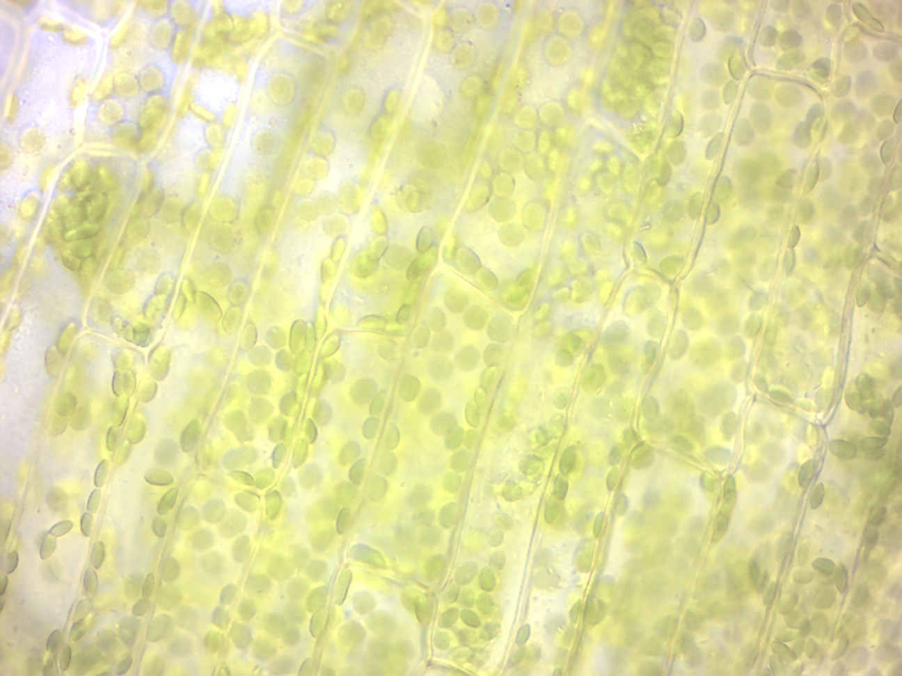
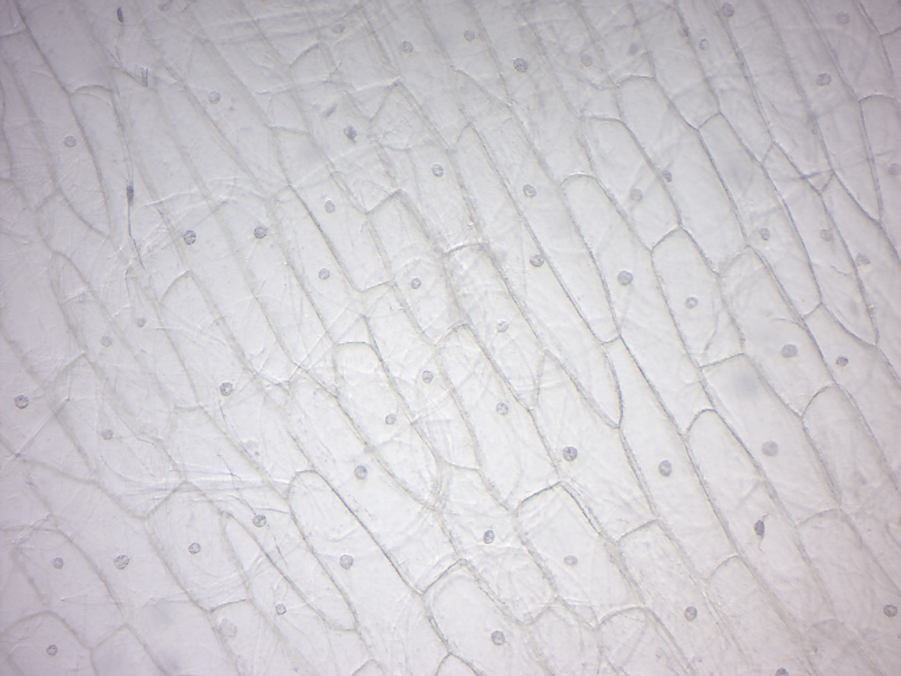
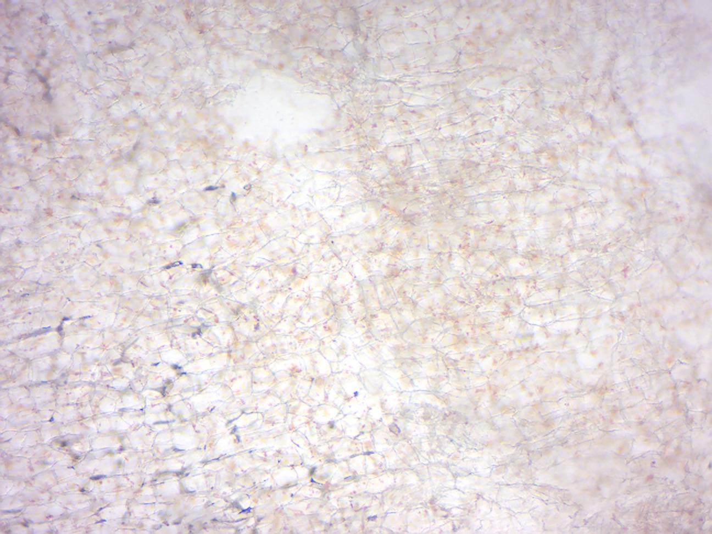
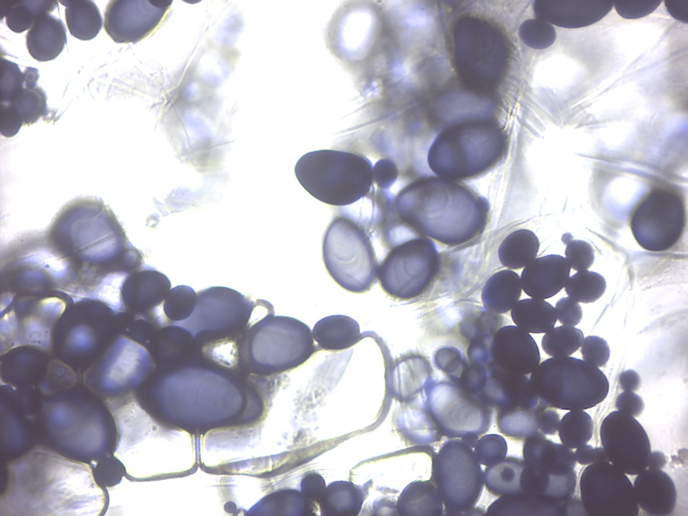
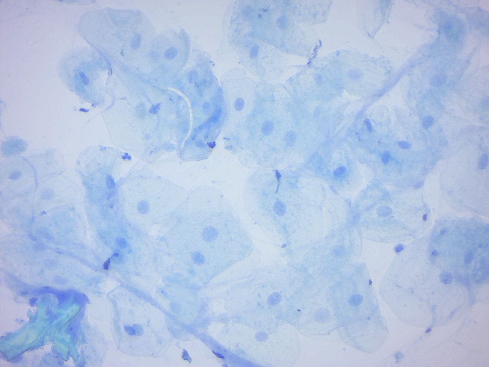
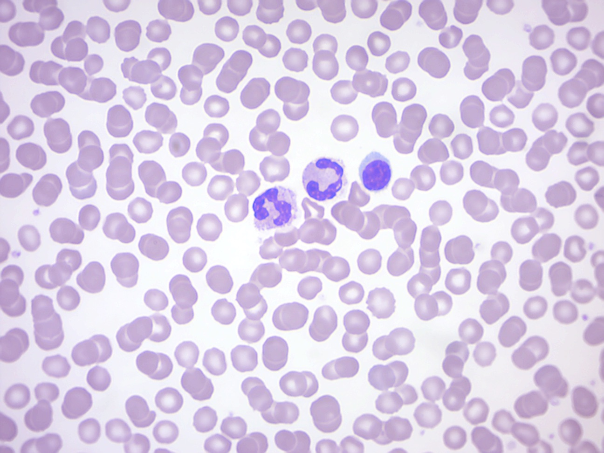

# Cell structure

The smallest unit of life is the [cell](https://en.wikipedia.org/wiki/Cell_(biology)). In this lab, we will look at eukaryotic (plant and animal) cells under the microscope.

```{r materials, fig.cap='Experimemntal materials', echo=FALSE, message=FALSE, warning=FALSE}
knitr::include_graphics("./figures/cell_struc/materials.jpg")
```

## Elodea cells
### Experimental procedures
1.	Get a single leaf from the Elodea plant and mount it on a slide, cover it with a drop of water and a cover slip.
2.	Look at the leaf under the microscope (Figure \@ref(fig:elodea)).
3.	Notice that the cells are clearly delineated by the cell wall. Inside the cells are large oval-shaped green bodies, the chloroplasts.

```{r elodea, fig.cap='Elodea wet mount (100× oil immersion objective).', echo=FALSE, message=FALSE, warning=FALSE}

```

## Onion leaf epidermal cells
### Experimental procedures
1.  Peel a thin layer of cells from the concave side of a piece of onion as shown in Figure \@ref(fig:onionpeel).
2.  Put the onion layer onto a new slide. Make sure the onion lays very flat and is not wrinkled or folded on your slide.
2.  You may use a razor blade and cut both sides of the onion so that you are left with a small rectangular piece of onion in the center of your slide.
3.  Add a drop of water on top of the small piece of onion in the center of your slide.
4.  Add a coverslip on top.
2.  Dim the light and find the nucleus, which is much easier to see here because there are no chloroplasts (Figure \@ref(fig:onion)). Close examination should reveal one or more nucleoli in the nucleus.
3.  Note the movement of small particles in the nearly transparent cytoplasm. This is Brownian movement, which we will study in more detail in another exercise.

```{r onionpeel, fig.cap='Peel a thin layer of cells off the convave side of an onion slice.', echo=FALSE, message=FALSE, warning=FALSE}
knitr::include_graphics("./figures/cell_struc/onionpeel.jpg")
```

```{r onion, fig.cap='Onion epidermis.', echo=FALSE, message=FALSE, warning=FALSE}

```

## Carrot root cells
### Experimental procedures
1.	Use a razor blade and shave a very thin (almost translucent) slice of carrot onto a slide and prepare a wet mount of it (Figure \@ref(fig:carot)).
2.	Observe the orange-yellow bodies called chromoplasts, another type of plastid. Chromoplasts are enriched in pigments that give flowers, fruits, and fall leaves their colors, and carrots their orange color.


```{r carot, fig.cap='Carrot wet mount.', echo=FALSE, message=FALSE, warning=FALSE}

```

## Potato cells
Potatoes are stems full of starch that is stored within the cells in colorless plastids called amyloplasts (Figure \@ref(fig:potato)).

### Experimental procedures
1.	Cut a very thin wedge-shaped sliver of potato.
2.	Place it on a microscope slide.
2.	Add a drop of iodine on top of the slice of potato.
3.	Place a coverslip on top.
4.	Observe the potato slice under the microscope.
4.	Iodine stains starch a purple or blue-black color.

```{r potato, fig.cap='Amyloblasts in potato cells. The starch inside of the amyloplasts is stained blue-black by the iodine solution.', echo=FALSE, message=FALSE, warning=FALSE}

```


## Cleaning up
Discard the used glass slides in the container marked "Broken glass" in the fume hood.

## Human cheek cells
The outer and inner surface of our body is formed by epithelial cells.

### Experimental procedures
1.	Rub the inner side of your cheek with a toothpick to pick up some cells.
2.	Scrape the cloudy (cell-containing) fluid onto a slide, add a drop of dilute methylene blue, and observe under the microscope (Figure \@ref(fig:cheek)). Note that bacteria and possibly fungi on top and around your cheek cells.

```{r cheek, fig.cap='Human cheek epidermal cells.', echo=FALSE, message=FALSE, warning=FALSE}

```

## Cleaning up
Dispose of the toothpicks and the slide with the cheek cells in the beakers containing (green looking) disinfectant liquid.

## Human blood cells
[Blood](https://en.wikipedia.org/wiki/Blood) is a body fluid in humans and other animals that delivers necessary substances such as nutrients and oxygen to the cells and transports metabolic waste products away from those same cells. In vertebrates, it is composed of blood cells suspended in blood plasma. Plasma, which constitutes 55% of blood fluid, is mostly water (92% by volume), and contains dissipated proteins, glucose, mineral ions, hormones, carbon dioxide (plasma being the main medium for excretory product transportation), and blood cells themselves. Albumin is the main protein in plasma, and it functions to regulate the colloidal osmotic pressure of blood. The blood cells are mainly red blood cells (also called RBCs or erythrocytes), white blood cells (also called WBCs or leukocytes) and platelets (also called thrombocytes). The most abundant cells in vertebrate blood are red blood cells. These contain hemoglobin, an iron-containing protein, which facilitates oxygen transport by reversibly binding to this respiratory gas and greatly increasing its solubility in blood. In contrast, carbon dioxide is mostly transported extracellularly as bicarbonate ion transported in plasma.
Vertebrate blood is bright red when its hemoglobin is oxygenated and dark red when it is deoxygenated. Some animals, such as crustaceans and mollusks, use hemocyanin to carry oxygen, instead of hemoglobin. Insects and some mollusks use a fluid called hemolymph instead of blood, the difference being that hemolymph is not contained in a closed circulatory system. In most insects, this "blood" does not contain oxygen-carrying molecules such as hemoglobin because their bodies are small enough for their tracheal system to suffice for supplying oxygen.
Jawed vertebrates have an adaptive immune system, based largely on white blood cells. White blood cells help to resist infections and parasites. Platelets are important in the clotting of blood.
Blood is circulated around the body through blood vessels by the pumping action of the heart. In animals with lungs, arterial blood carries oxygen from inhaled air to the tissues of the body, and venous blood carries carbon dioxide, a waste product of metabolism produced by cells, from the tissues to the lungs to be exhaled.

### Experimental procedures
1.	Look at the prepared slide containing a human blood stain (Figure \@ref(fig:blood)).
2.	Can you distinguish multiple types of white blood cells?
3.	Return the slide to the white slide box.

```{r blood, fig.cap='Human blood smear. Note red and two types of white blood cells.', echo=FALSE, message=FALSE, warning=FALSE}

```

## Review Questions
1. What are the main structural features of eukaryotic cells?
2. What distinguishes animal cells from plant cells?
3. What are mitochondria?
4. What are chloroplasts?
