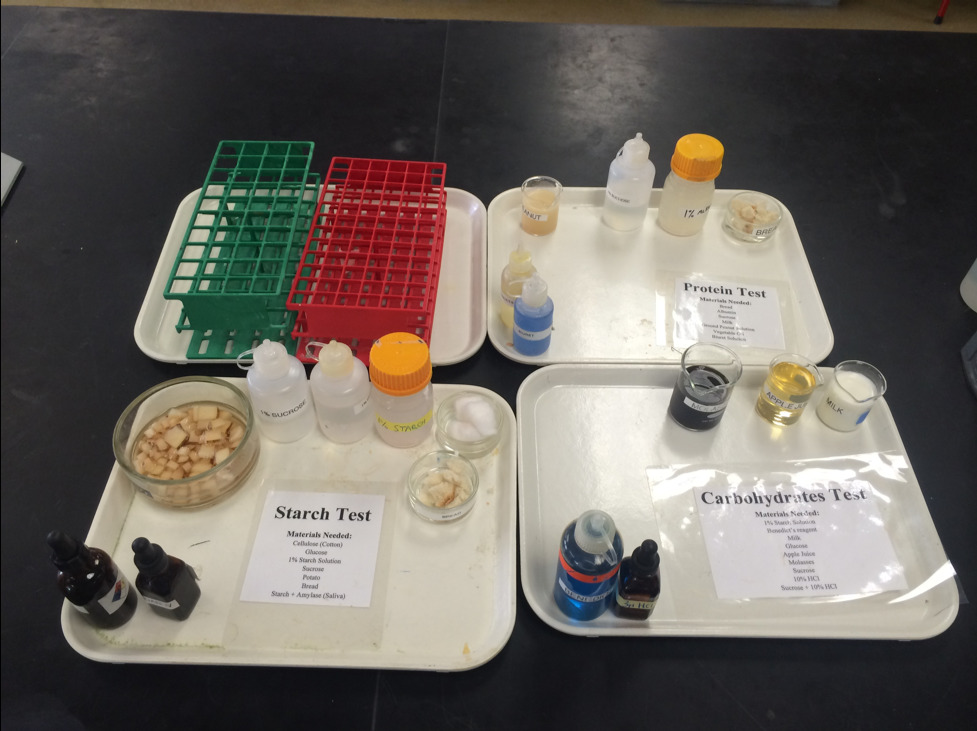
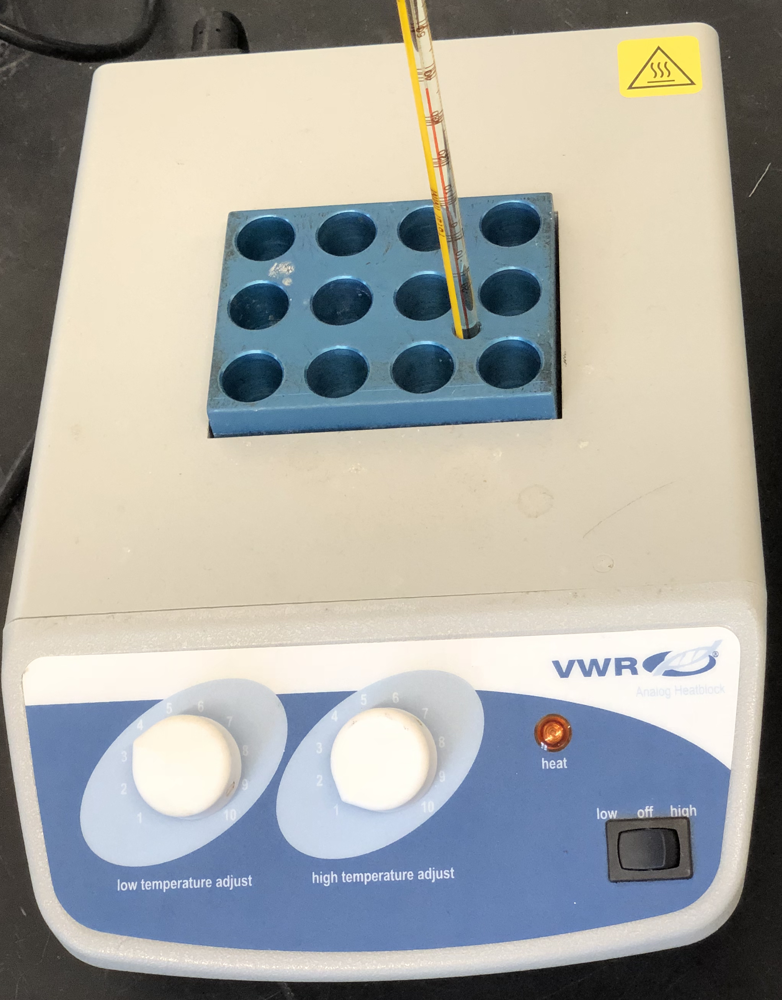
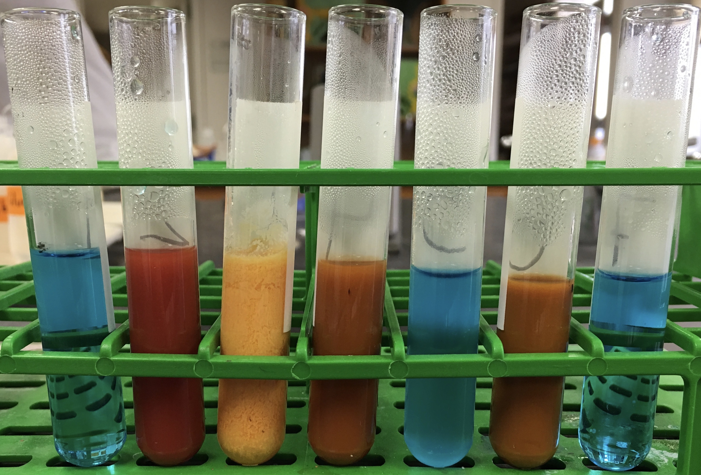
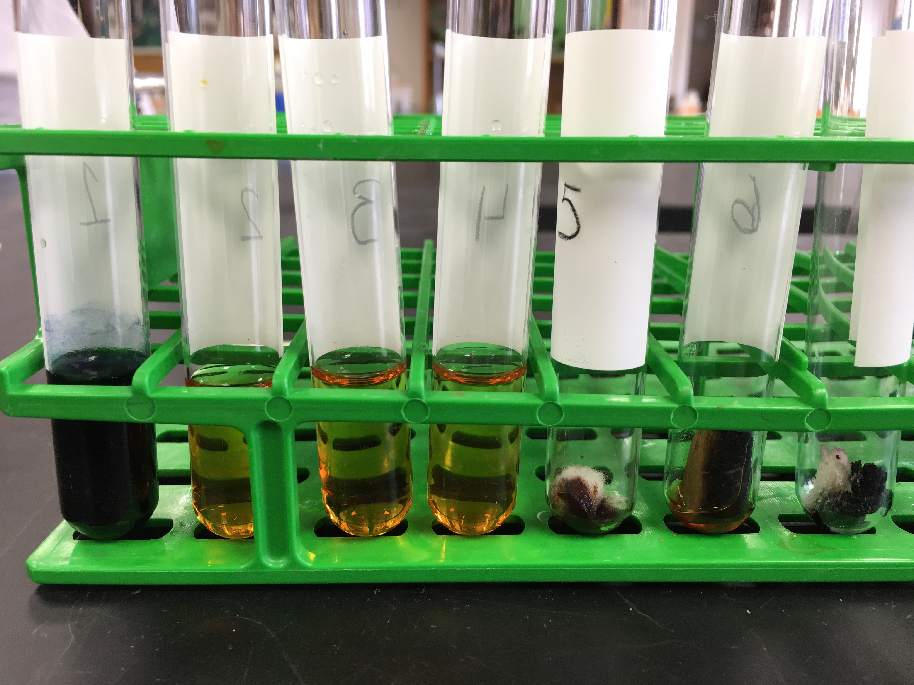
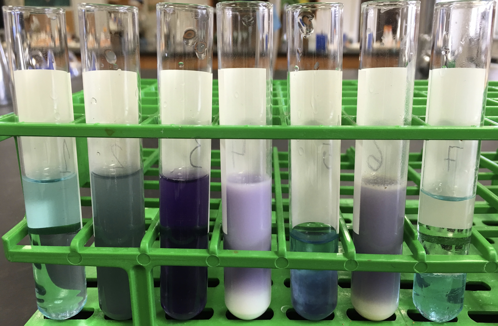

# Chemical Aspects of Life

[Everything that we can bump into, touch or squeeze including living things are composed of atoms.](https://en.wikipedia.org/wiki/Matter) [Chemical elements](https://en.wikipedia.org/wiki/Chemical_element) are pure substances of one type of [atom](https://en.wikipedia.org/wiki/Atom). Atoms combine to form [molecules](https://en.wikipedia.org/wiki/Molecule). Molecules combined of more than one element are called compounds.

Commonly people distinguish between organic and inorganic compounds. However, there is no clear or universally agreed-upon distinction between organic and inorganic compounds. Organic chemists traditionally and generally refer to any molecule containing carbon as an organic compound and by default this means that inorganic chemistry deals with molecules lacking carbon. As many minerals are of biological origin, biologists may distinguish organic from inorganic compounds in a different way that does not hinge on the presence of a carbon atom. Pools of organic matter, for example, that have been metabolically incorporated into living tissues persist in decomposing tissues, but as molecules become oxidized into the open environment, such as atmospheric CO~2~, this creates a separate pool of inorganic compounds. The International Union of Pure and Applied Chemistry (IUPAC), an agency widely recognized for defining chemical terms, does not offer definitions of inorganic or organic compounds. Hence, the definition for an inorganic versus an organic compound in a multidisciplinary context spans the division between organic life living (or animate) and inorganic non-living (or inanimate) matter. In broader speech, the term commonly referred to compounds synthesized by purely geological systems, in contrast to those with a biological component in their origin.

Cells consist mostly of water (70%-90%). The bulk of their dry weight consists of compounds containing the elements carbon (C), hydrogen (H), oxygen (O), nitrogen (N), and phosphorus (P). The four major types of organic biomolecules are carbohydrates, lipids, proteins and nucleic acids. The more complex members of these categories (biomacromolecules) are made up of chains of smaller molecules (monomers) strung together more or less like beads in a necklace. These complex molecules are called polymers. In living organisms, polymers are made by dehydration synthesis, the loss of a water molecule between each pair of monomers. Conversely, polymers can be digested (broken up into monomers) by the addition of a molecule of water between each pair of monomers. This process is known as hydrolysis.

Carbohydrates are biomolecules consisting of carbon (C), hydrogen (H) and oxygen (O) atoms, usually with a hydrogen to oxygen atom ratio of 2:1 (as in water) with the formula C~n~(H~2~O)~n~.

Lipids are substances of biological origin that are insoluble in water. Lipids comprise a group of naturally occurring molecules that include fats, waxes, sterols, fat-soluble vitamins (such as vitamins A, D, E, and K), monoglycerides, diglycerides, triglycerides, and phospholipids. The main biological functions of lipids include storing energy, signaling, and acting as structural components of cell membranes.

Proteins are large biomolecules consisting of one or more long chains of amino acids linked by peptide bonds. Proteins perform a vast array of functions within organisms, including catalyzing metabolic reactions, DNA replication, responding to stimuli, and transporting molecules from one location to another. Proteins differ from one another primarily in their sequence of amino acids, which is dictated by the nucleotide sequence of their genes, and which usually results in protein folding into a specific three-dimensional structure that determines its activity.
```{r setup, fig.cap='Experimental materials for this lab', echo=FALSE, message=FALSE, warning=FALSE}

```
## Test for Reducing sugars
A [reducing sugar](https://en.wikipedia.org/wiki/Reducing_sugar) is one that reduces another compound and is itself oxidized; that is, the carbonyl carbon of the sugar is oxidized to a carboxyl group. A reducing sugar has a free aldehyde group or a free ketone group.  All monosaccharides are reducing sugars, along with some disaccharides, oligosaccharides, and polysaccharides. Monosaccharides which contain an aldehyde group are known as aldoses, and those with a ketone group are known as ketoses. The aldehyde can be oxidized via a redox reaction in which another compound is reduced. Thus, a reducing sugar is one that reduces certain chemicals. Sugars with ketone groups in their open chain form are capable of isomerizing via a series of tautomeric shifts to produce an aldehyde group in solution. Therefore, ketone-bearing sugars like fructose are considered reducing sugars but it is the isomer containing an aldehyde group which is reducing since ketones cannot be oxidized without decomposition of the sugar. This type of isomerization is catalyzed by the base present in solutions which test for the presence of aldehydes. Aldoses or aldehyde-bearing sugars are reducing also because during oxidation of aldoses, there are certain oxidizing agents that are reduced. The common dietary monosaccharides galactose, glucose and fructose are all reducing sugars. Many disaccharides, like lactose and maltose, also have a reducing form, as one of the two units may have an open-chain form with an aldehyde group.  However, sucrose is a non-reducing disaccharide since neither of the rings is capable of opening.
Benedict's reagent (Cu^2+^ in aqueous sodium citrate) is used as a qualitative test to detect the presence of reducing sugars. The reducing sugar reduces the copper(II) ions to copper(I), which then forms a brick red copper(I) oxide precipitate.

```{r heatblock, fig.cap='Heat block ("dry bath")', echo=FALSE, message=FALSE, warning=FALSE}

```

### Experimental procedures
1.	Turn on the 65°C heat block (Figure \@ref(fig:heatblock)) by pushing the little black switch on the lower right side of the to "high". Rotate the white "high temperature adjust" button to number 3.
2.	Turn on the 37°C heat block by pushing the little black switch on the lower right side of the to "low". Rotate the white "low temperature adjust" button to number 4.
1.	Obtain 7 plastic test tubes and a test tube rack.
2.	Using a wax pencil,label each tube with a number (1 to 7).
3.	Place the tubes from left (tube #1) to right (tube #7) in the first row of a test tube rack.
4.	Add the test material each tube as indicated in Table \@ref(tab:sugar).
5.	Add 2 ml of Benedict's reagent to each tube using a plastic transfer pipette.
Figure 5 Plastic transfer pipette (3 ml capacity.
6.	Mix well.
7.	Check the that the temperature of the heat block is ~65°C and then place the tubes in the heat block. Set a timer and incubate the tubes for 15 minutes. Begin setting up Experiment 2 (below) while the tubes are incubating.
8.	After 15 minutes, remove the tubes using a test tube holder (be careful, they are hot!), place them in the tube rack and record the color (in your own words) in Table \@ref(tab:sugar).

Table: (\#tab:sugar) Test for reducing sugars.

|Tube #  |Test material      |	Benedict's  |Observed color |Test Result (+ or -)
|:------:|:------------------|:-----------:|:-------------:|:-------------------:|
1	       |2 ml H~2~O         |	2 ml       |               |                     |
2	       |2 ml glucose       |  2 ml       |               |                     |
3	       |2 ml milk          |	2 ml       |               |                     |
4	       |2 ml apple juice   |	2 ml       |               |                     |
5	       |2 ml starch        |	2 ml       |               |                     |
6        |2 ml molasses      |	2 ml       |               |                     |
7	       |2 ml sucrose	     | 2 ml        |               |                     |


```{r exp1, fig.cap='Results from experiment 1. Compare to your results!', echo=FALSE, message=FALSE, warning=FALSE}

```

## Test for Starch
Starch is a polymeric carbohydrate consisting of a large number of glucose units joined by glycosidic bonds. This polysaccharide is produced by most green plants as energy storage. It is the most common carbohydrate in human diets and is contained in large amounts in staple foods like potatoes, wheat, maize (corn), rice, and cassava. Pure starch is a white, tasteless and odorless powder that is insoluble in cold water or alcohol. It consists of two types of molecules the linear and helical amylose and the branched amylopectin.

An [amylase](https://en.wikipedia.org/wiki/Amylase) is an enzyme that catalyzes the hydrolysis of starch into maltose and glucose. Amylase is present in the saliva of humans, where it begins the chemical process of digestion. It is also produced by the pancreas.

### Experimental procedures
1.	Obtain 9 plastic test tubes and a test tube rack.
2.	Using a wax pencil,label each tube with a number (1 to 9).
3.	Place the tubes from left (tube #1) to right (tube #9) in the first row of a test tube rack.
4.	Add the test material to tubes 1 to 9 as indicated in the table below. Leave tube 9 empty.
5.	Check the that the temperature of the heat block is ~37°C and then place tube #8 in the heat block. Set a timer and incubate the tubes for 15 minutes.
6.	Add 5 drops of Iodine solution to the test tubes #1 to # 7. Mix well.
7.	Record the color (in your own words) in in Table \@ref(tab:starch).
8.	After 15 minutes, remove test tube 8 from the heat block and transfer 2 ml (half of the contents of test tube 8) to tube 9.
9.	Add 5 drops of iodine to tube 8 and record your observation in Table \@ref(tab:starch).
10.	Add 2 ml of Benedict's solution to tube #9.
11.	Place tube 9 in the ~65°C heat block. Set a timer and incubate the tube for 15 minutes.
12.	After 15 minutes, remove tube 9 using a test tube holder (be careful, it is hot!), place it in the tube rack and record the color (in your own words) in the table.

Table: (\#tab:starch) Test for starch.

|Tube # | Test material      |	Iodine       | Observed color |	Test Result (+ or -)
|:------:|:-------------------|:------------:|:--------------:|:------------------:|
1        | 2 ml starch        |	5 drops      |                |                    |
2        | 2 ml glucose       |	5 drops      |                |                    |
3	       | 2 ml H~2~O	        | 5 drops      |                |                    |
4        | 2 ml sucrose       | 5 drops      |                |                    |
5        | cotton (cellulose) |	5 drops      |                |                    |
6        | a small piece of bread|5 drops  |                |                    |
7        | a small piece of potato|	5 drops|                |                    |
8        | 2 ml of starch plus 2 ml of amylase|5 drops|      |                    |
9        | Leave empty then follow step 8 above|2 ml of Benedict's solution| |    |


```{r exp2, fig.cap='Results from experiment 2. Compare to your results!', echo=FALSE, message=FALSE, warning=FALSE}

```

## Test for Proteins
[Proteins](https://en.wikipedia.org/wiki/Protein) are large biomolecules, or macromolecules, consisting of one or more long chains of amino acid residues. Proteins perform a vast array of functions within organisms, including catalyzing metabolic reactions, DNA replication, responding to stimuli, and transporting molecules from one location to another. Proteins differ from one another primarily in their sequence of amino acids, which is dictated by the nucleotide sequence of their genes, and which usually results in protein folding into a specific three-dimensional structure that determines its activity.
A linear chain of amino acid residues is called a polypeptide. A protein contains at least one long polypeptide. Short polypeptides, containing less than 20-30 residues, are rarely considered to be proteins and are commonly called peptides, or sometimes oligopeptides. The individual amino acid residues are bonded together by peptide bonds and adjacent amino acid residues. The sequence of amino acid residues in a protein is defined by the sequence of a gene, which is encoded in the genetic code. In general, the genetic code specifies 20 standard amino acids; however, in certain organisms the genetic code can include selenocysteine and-in certain archaea-pyrrolysine.

The biuret test is a chemical test used for detecting the presence of peptide bonds. In the presence of peptides, a copper(II) ion forms violet-colored coordination complexes in an alkaline solution. The biuret reaction can be used to assess the concentration of proteins because peptide bonds occur with the same frequency per amino acid in the peptide. The intensity of the color is directly proportional to the protein concentration.
Despite its name, the reagent does not in fact contain biuret ((H~2~N-CO-)~2~NH). The test is named so because it also gives a positive reaction to the peptide-like bonds in the biuret molecule.
In this assay, the copper(II) binds with nitrogen present in the peptides of proteins. In a secondary reaction, the copper(II) is reduced to copper(I). Due to its insensitivity and little interference by free amino acids, this assay is most useful for whole tissue samples and other sources with high protein concentration.

### Experimental procedures
1.	Obtain 7 plastic test tubes and a test tube rack.
2.	Using a wax pencil,label each tube with a number (1 to 7).
3.	Place the tubes from left (tube #1) to right (tube #7) in the first row of a test tube rack.
2.	Add the materials to these tubes as indicated in Table \@ref(tab:protein) and mix well. No heating is needed to produce a reaction.
3.	Wait 2 minutes and then record your observations in the table below. Base your conclusion only on the presence or absence of the violet color.

Table: (\#tab:protein) Test for protein.

|Tube # |Test material      |Biuret       |Observation    |Test
|:------:|:---------------------|:--------:|:-------------:|:-------------------:|
1        |2 ml H~2~O            |2 ml      |               |                     |
2        |2 ml sucrose          |2 ml      |               |                     |
3        |2 ml albumin          |2 ml      |               |                     |
4        |2 ml milk             |2 ml      |               |                     |
5        |a small piece of bread|2 ml      |               |                     |
6        |2 ml soy              |2 ml      |               |                     |
7        |2 ml vegetable oil    |2 ml      |               |                     |


```{r exp3, fig.cap='Results from experiment 3. Compare to your results!', echo=FALSE, message=FALSE, warning=FALSE}

```

## Cleaning up
1. Empty the contents of all plastic tubes into the labeled waste container (brown bottle) in the chemical fume hood.
2. Discard the empty tubes in the regular waste basket.

## Test for Lipids
In biology, a [lipid](https://en.wikipedia.org/wiki/Lipid) is a substance of biological origin that is soluble in nonpolar solvents. It comprises a group of naturally occurring molecules that include fats, waxes, sterols, fat-soluble vitamins (such as vitamins A, D, E, and K), monoglycerides, diglycerides, triglycerides, and phospholipids. The main biological functions of lipids include storing energy, signaling, and acting as structural components of cell membranes. Lipids have applications in the cosmetic and food industries as well as in nanotechnology.
Scientists sometimes broadly define lipids as hydrophobic or amphiphilic small molecules; the amphiphilic nature of some lipids allows them to form structures such as vesicles, liposomes, or membranes in an aqueous environment.
Although the term "lipid" is sometimes used as a synonym for fats, fats are a subgroup of lipids called triglycerides. Lipids also encompass molecules such as fatty acids and their derivatives (including tri-, di-, mono-glycerides, and phospholipids), as well as other sterol-containing metabolites such as cholesterol. Although humans and other mammals use various biosynthetic pathways both to break down and to synthesize lipids, some essential lipids cannot be made this way and must be obtained from the diet.

### Experimental procedures

1.	Obtain a small glass tube.
2.	Add 2 ml of water into the glass tube.
2.	Add 6 drops of vegetable oil to on top.
3.	Shake thoroughly and observe the way the oil is dispersed only temporarily. This is an emulsion a mixture of two liquids, each insoluble in the other.
4.	Now add 3 drops of lipid-specific red Sudan stain and mix again.
5.	Add 2 ml of a liquid detergent to the tube and shake again.
6.	Allow the tube to stand and note that the two phases (oil and water) are no longer distinctly separated. Detergent is often termed an emulsifier. Its molecules are water-soluble on one end and lipid-soluble on the other. These surround small oil droplets, water-soluble end out, and allow the droplets to stay suspended in the water.

## Cleaning up
Empty the contents of the glass tube into the labeled waste container (brown bottle) in the chemical fume hood. Discard the glass tube in the plastic container labeled "broken glass" in the chemical fume hood.

## Test for organic and inorganic compounds (Demonstration)
### Experimental procedures
1.	The instructor will use as Bunsen burner to heat a number of substances. Organic substances will burn, inorganic substances will remain unchanged.
2.	Record your observation in Table \@ref(tab:organic).

Table: (\#tab:organic) Test for organic and inorganic compounds.

Substance |	Organic |	Inorganic
|:---------|:-------:|:--------:|
sugar      |         |          |
table salt |         |          |
baking soda|         |          |
unknown    |         |          |

## Strawberry DNA extraction

We will use strawberries for [DNA](https://en.wikipedia.org/wiki/DNA) isolation. Wild strawberries (Fragaria vesca) are "diploid" organisms (two sets of chromosomes; 14 total), just like us, but the at a size of 240 million base the strawberry genome (which has been fully sequenced) is much smaller than ours (3 billion bases). The cultivated strawberry, Fragaria ananassa, were generated only about 250 years ago are thus a very young crop species. Botanically, it is neither a berry nor a true fruit. Strawberry "fruits" consist of dry seeds that dot the surface of a fleshy modified shoot tip (the receptacle). Genomically, Fragaria ananassa is among the most complex of crop plants they harbor eight sets of chromosomes (2n = 8x = 56), which are originally derived from as many as four different diploid ancestors. Thus, *Fragaria ananassa*, is an octoploid organism, with 4 times more DNA in each cell than wild strawberries. This property makes this fruit a great choice for demonstrating DNA extraction. In addition, strawberries are soft and easy to homogenize and ripe.

The first step of DNA extraction from live or dead cells is to lyse or break open the cell. After the cells have broken open, a salt solution such as sodium chloride (NaCl) and a detergent solution containing the compound SDS (sodium dodecyl sulfate) is added. This solution breaks down and emulsifies the fat & proteins that make up the cell membrane. Finally, ice cold ethanol is added. The alcohol and salt cause the DNA to precipitate, or settle out of the solution, leaving behind all the cellular components that aren't soluble in alcohol. The DNA can be spooled (wound) on a stirring rod and pulled from the solution at this point.

It is important to mention that the procedure for DNA extraction we are using is really a procedure for total nucleic acid extraction. However, much of the RNA extracted is cut by ribonucleases (enzymes that cut RNA) that come in contact with the RNA when the cells are broken open.

### Experimental procedures
1.	Place 2 to 4 strawberries in a zip lock bag.  Gently, mash up the fruit by pushing the bags with your hand against the lab bench. This will mechanically breakdown the cell wall.
2.	Add 15 ml of the extraction buffer to the bag. Mix and mash again for one minute (chemical portion of the extraction procedure to lyse the cell membranes to release the DNA).
3.	Filter the homogenate using cheesecloth. Hold the cheesecloth over the beaker with the help of a rubber band.  This step removes cell organelles, broken cell walls, membrane fragments, and other cell debris.
4.	Collect the filtrate; squeeze the cheesecloth to get the as much of the lysate as possible.
5.	Pour the filtrate into a plastic tube. Fill the tube to about half the volume
6.	Use the transfer pipet to drip alcohol slowly down the sides of the tube (about 5 ml of ice cold alcohol), while holding the tube at approximately an angle of 45o.  Try to make a clear and undisturbed layer of alcohol to float on the lysate.  The line between the two layers is called the interface.
7.	At the interface, you will see the DNA precipitate out of solution and float to the top. Spool the DNA on your glass rod.

## Cleaning up
1.  Empty the contents of the plastic tube into the labeled waste container (brown bottle) in the chemical fume hood.
2.  Discard the empty tubes and other waste in the regular waste basket.
3.  Rinse the glass rod and glassware with water and detergent.
4.  Return the glass rod and glass ware to the trays on your bench where you originally found them.

## Review Questions
1. What are organic compounds?
2. Which are the five most common elements in living organisms?
2. What are the four major groups of biomacromolecules?
3. What are the building blocks (monomers) of DNA?
4. What are lipids?
5. What are proteins?
6. What is a peptide bond?
7. What is chemical reduction?
8. What is chemical oxidation?
9. What are detergents?
10. Why do we use the detergent in the DNA extraction experiment?
