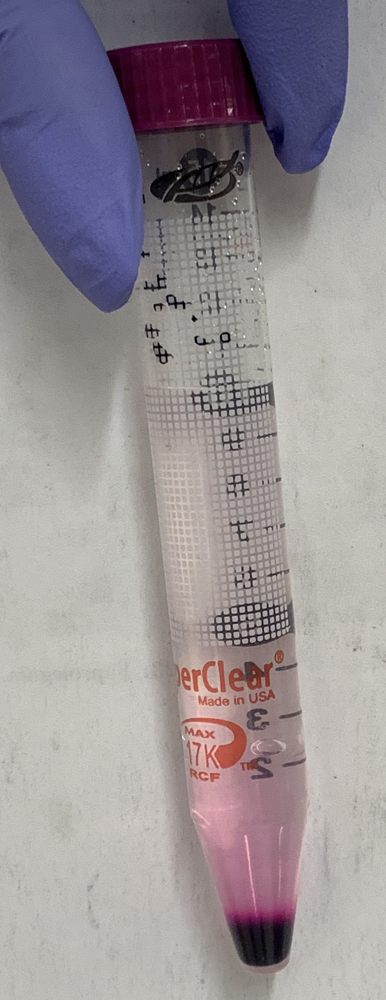
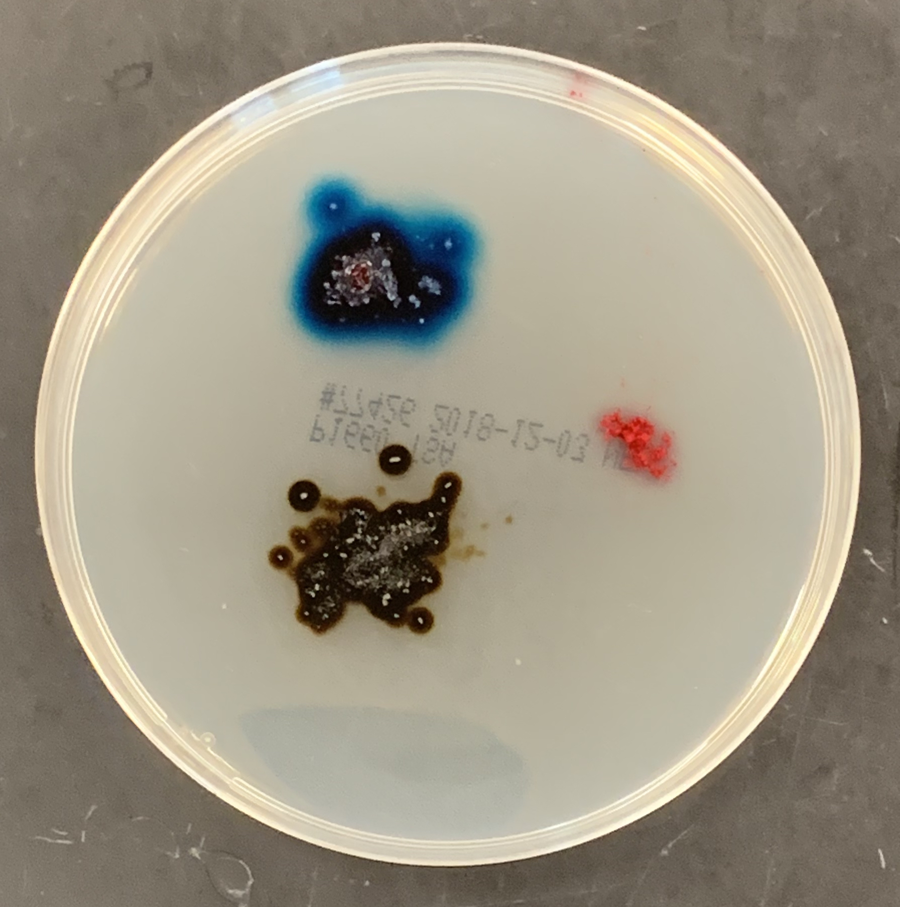
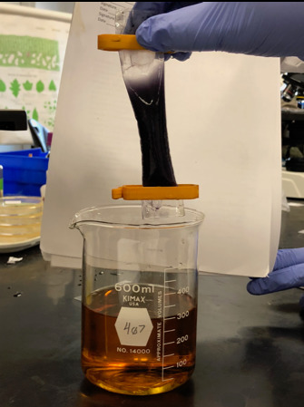
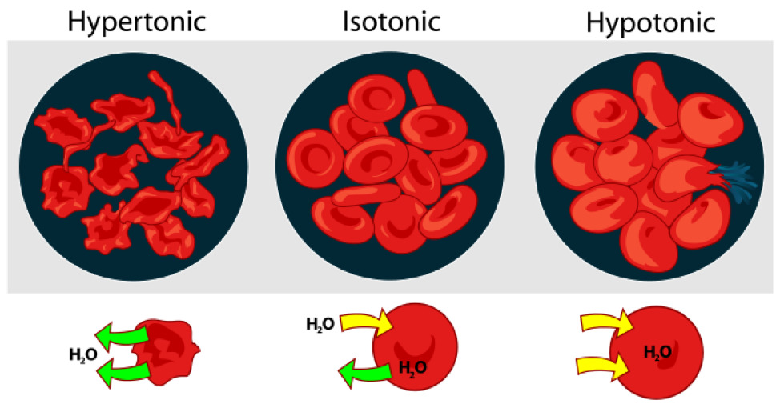
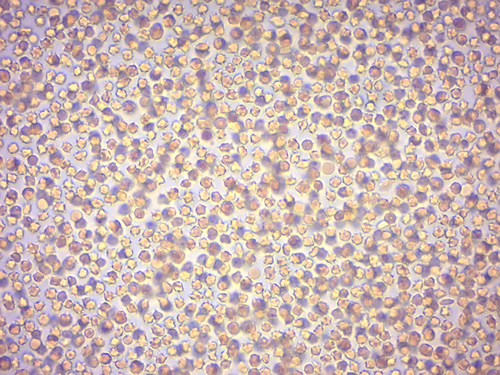
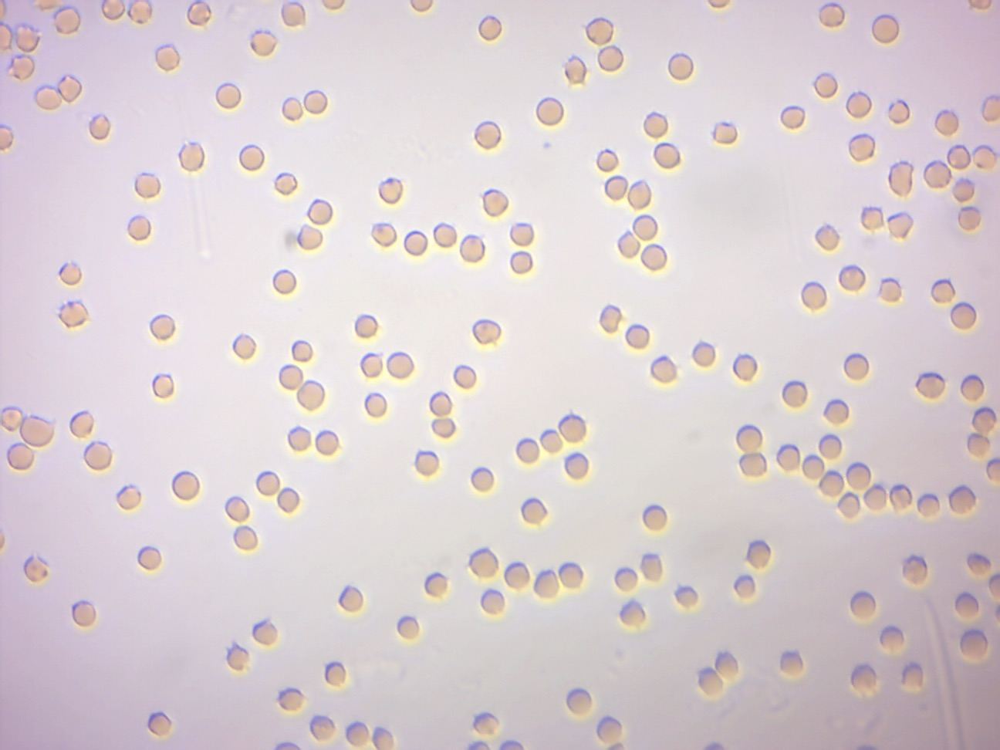
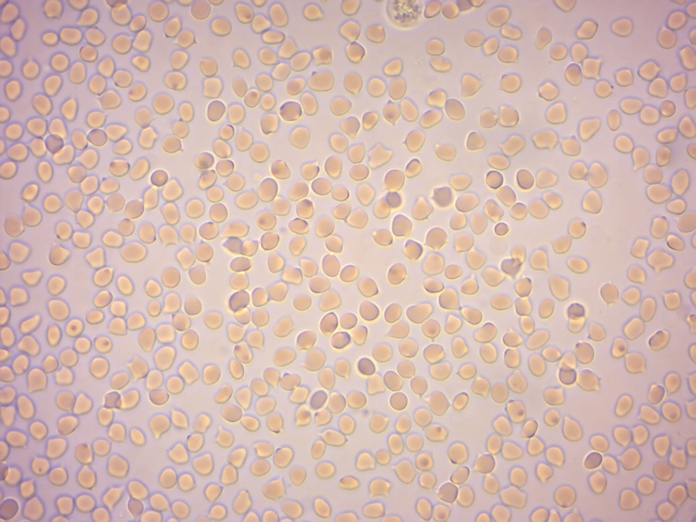
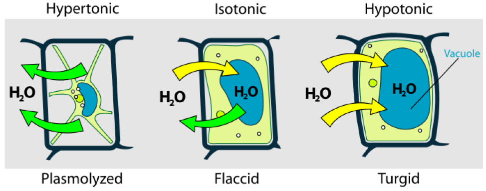
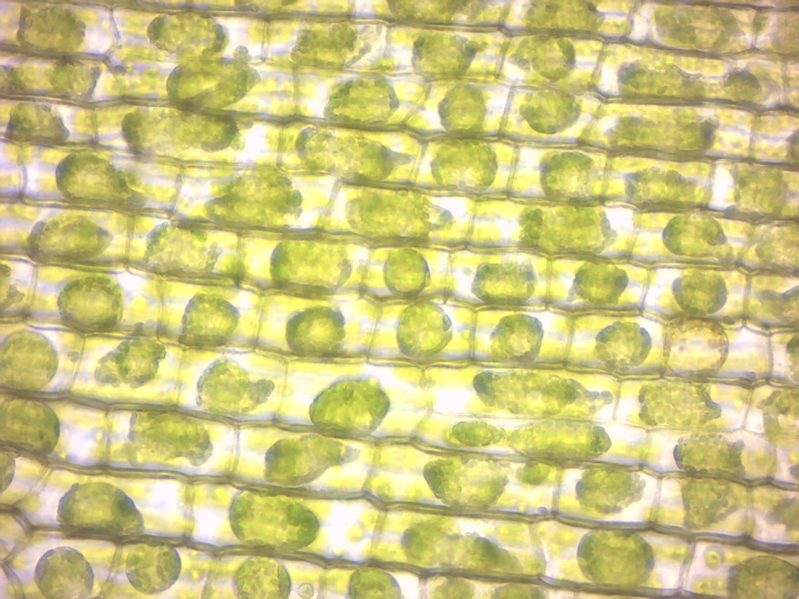

# Exchange Between Cells and Their Environment

## Diffusion

[Diffusion](https://en.wikipedia.org/wiki/Diffusion) is the net movement of molecules or atoms from a region of high concentration (or high chemical potential) to a region of low concentration (or low chemical potential) as a result of random motion of the molecules or atoms. The word diffusion derives from the Latin word, diffundere, which means "to spread way out".

Diffusion is driven by a gradient in chemical potential of the diffusing species. A gradient is the change in the value of a quantity e.g. concentration, pressure, or temperature with the change in another variable, usually distance. A change in concentration over a distance is called a concentration gradient, a change in pressure over a distance is called a pressure gradient, and a change in temperature over a distance is a called a temperature gradient.

A distinguishing feature of diffusion is that it depends on particle random walk, and results in mixing or mass transport without requiring directed bulk motion. 

## Diffusion in air

### Experimental procedures

1. The instructor will open a bottle containing a fragrant substance.
2. Raise your hand when you smell the odor.

## Diffusion in water

### Experimental procedures
1. Add 10 mL of water to a plastic test tube.
2. Drop a crystal of purple KMnO~4~ (potassium permanganate) into it.
3. Put the tube in a test tube rack and place it where it will not be disturbed for the remainder of the lab period
4. From time to time, observe the how the KMnO~4~ diffuses through the water.

```{r liquid, fig.cap='Diffusion of a solid (KMnO~4~) in a liquid (H~2~O).', echo=FALSE, message=FALSE, warning=FALSE}

```

## Diffusion in a solid

### Experimental procedures
1. Place a few crystals of KMnO~4~ onto a Petri dish with agarose gel.
2. Place a few crystals of malachite green about 2 centimeters from the potassium permanganate crystal.
3. Place a few specks of carmine red about 2 cm from each of the other crystals.
3. Note the rate of diffusion.
4. Find the molecular weights of each compound from [Wikipedia](https://www.wikipedia.org).

```{r solid, fig.cap='Diffusion of three different solids through agarose.', echo=FALSE, message=FALSE, warning=FALSE}

```

## Diffusion Through a Selectively Permeable Membrane

A selectively permeable membrane is a type of biological or synthetic, polymeric membrane that will allow certain molecules or ions to pass through it by diffusion—or in the case of bioloigcal membranes (e.g. the cell membrane) by more specialized processes such as facilitated diffusion and active transport. In this experiment we will use a dialysis or [semipermeable membrane](https://en.wikipedia.org/wiki/Semipermeable_membranea)–a selectively permeable membrane that allows particles below a certain size through but excludes any particles that are larger. 

### Experimental procedures
1. Fill a 500-ml beaker with 300 ml of water.
2. Get a ~10 cm long piece of dialysis tubing and submerge it for ~ 10 seconds in the water.
3. Remove the dialysis tubing and clamp one end with the yellow clamp.
4. Rub the other end between the tips of your thumb and index fingers to open the dialysis membrane.
5. Get the starch solution and shake it well.
6. Fill the dialysis tubing with ~10 ml of starch solution.
7. Clamp off the open end.
8. Rinse with tap water.
9. Add iodine solution to the beaker with water until the solution becomes dark orange.
10. Add the dialysis tube containing the starch to the beaker and submerge completely in the water.
11. After about 15 minutes, observe the bag and surrounding liquid for any color change.
12. When starch molecules touch iodine, a blue or purplish color appears.
13. Start setting up Experiment 3 while you wait.

```{r dialysis, fig.cap='Result of the dialysis experiment.', echo=FALSE, message=FALSE, warning=FALSE}

```

## Brownian motion
[Brownian motion](https://en.wikipedia.org/wiki/Brownian_motion) is the random motion of particles suspended in a fluid (a liquid or a gas) resulting from their collision with the fast-moving molecules in the fluid. This motion is named after [Robert Brown](https://en.wikipedia.org/wiki/Robert_Brown_(botanist,_born_1773)) (botanist, born 1773). In 1827, while looking through a microscope at particles trapped in cavities inside pollen grains in water, he noted that the particles moved through the water; but he was not able to determine the mechanisms that caused this motion. Atoms and molecules had long been theorized as the constituents of matter, and Albert Einstein published a paper in 1905 that explained in precise detail how the motion that Brown had observed was a result of the pollen being moved by individual water molecules, making one of his first big contributions to science. This explanation of Brownian motion served as convincing evidence that atoms and molecules exist and was further verified experimentally by Jean Perrin in 1908. Perrin was awarded the Nobel Prize in Physics in 1926 "for his work on the discontinuous structure of matter". The direction of the force of atomic bombardment is constantly changing, and at different times the particle is hit more on one side than another, leading to the seemingly random nature of the motion.

### Experimental procedures

1. Put a drop of water on a microscope slide.
1. Take a toothpick and pick up a tiny bit of powdered carmine form the carmine container.
3. Hold the toothpick over the drop of water on the slide and tap it so that small specs of carmine fall into the water on the slide.
4. Add a coverslip on top of the drop of water with the carmine on the slide.
5. Put the slide under the microscope.
6. Observe the quivering motion of the particles under high power. A mass movement of particles in any one direction may result if the micro- scope is not quite level, or you are using only one stage clip, or the coverslip is caught under the stage clips. This is not what you are looking for.

## Osmosis in Animal and Plant Cells
[Osmosis](https://en.wikipedia.org/wiki/Osmosis) is the spontaneous net movement of solvent molecules through a selectively-permeable membrane into a region of higher solute concentration, in the direction that tends to equalize the solute concentrations on the two sides. A selectively permeable membrane is a membrane that is permeable for some but not other molecules. Osmotic pressure is defined as the external pressure required to be applied so that there is no net movement of solvent across the membrane. Osmotic pressure is a colligative property, meaning that the osmotic pressure depends on the molar concentration of the solute but not on its identity.
Osmosis is a vital process in biological systems, as biological membranes are selectively permeable. In general, these membranes are impermeable to large and polar molecules, such as ions, proteins, and polysaccharides, while being permeable to non-polar or hydrophobic molecules like lipids as well as to small molecules like oxygen, carbon dioxide, nitrogen, and nitric oxide. Permeability depends on solubility, charge, or chemistry, as well as solute size. Water molecules travel through the plasma membrane, tonoplast membrane (vacuole) or protoplast by diffusing across the phospholipid bilayer via aquaporins (small transmembrane proteins similar to those responsible for facilitated diffusion and ion channels). Osmosis provides the primary means by which water is transported into and out of cells. The turgor pressure of a cell is largely maintained by osmosis across the cell membrane between the cell interior and its relatively hypotonic environment.

In unusual environments, osmosis can be very harmful to organisms. For example, freshwater and saltwater aquarium fish placed in water of a different salinity than that to which they are adapted to will die quickly, and in the case of saltwater fish, dramatically. Another example of a harmful osmotic effect is the use of table salt to kill leeches and slugs.
Suppose an animal or a cell is placed in a solution of sugar or salt in water.
1. If the medium is hypotonic relative to the cell cytoplasm - the cell will gain water through osmosis.
2. If the medium is isotonic - there will be no net movement of water across the cell membrane.
3. If the medium is hypertonic relative to the cell cytoplasm - the cell will lose water by osmosis.
Essentially, this means that if a cell is put in a solution which has a solute concentration higher than its own, it will shrivel, and if it is put in a solution with a lower solute concentration than its own, the cell will swell and may even burst.

## Crenation and Hemolysis of Red Blood Cells
[Crenation](https://en.wikipedia.org/wiki/Crenation) (Figure \@ref(fig:osmosisb)) is used to describe blood cells that look as if they have projections extending from a smaller central area, like a spiked ball. Hemolysis or haemolysis is the rupturing (lysis) of red blood cells (erythrocytes) and the release of their contents (cytoplasm) into surrounding fluid (e.g. blood plasma).

(ref:osmosisb) [Osmosis in red blood cells.](https://commons.wikimedia.org/wiki/File:Osmotic_pressure_on_blood_cells_diagram.svg)

```{r osmosisb, fig.cap='(ref:osmosisb)', echo=FALSE, message=FALSE, warning=FALSE}

```

### Experimental procedures
1. Work in groups of three students
2. Get three clean slides.
3. With a wax pencil, mark the first slide "5%", the second "0.85%", and the third "0%".
4. Using a plastic transfer pipette, place a drop of 5% NaCl solution just slightly off center on the first slide (labelled "5%"), then place a drop of 0.85% NaCl solution just slightly off center on the second slide (labelled "0.85%") and finally place a drop of distilled water just slightly off center on the last slide (labelled "0%").
5. To each of the three slides, add a small drop of sheep's blood beside the drop of saline or water.
6. Put a coverslip on top of the adjacent drops of liquid and blood on each slide. Raise and lower the coverslip a couple of times to mix the blood and saline.
7. Place each slide on the stage of a three microscopes that are side by side.
7. Using the 4× objective, focus on the blood and choose an area where the cells are thinly distributed.
8. Switch  to the to 10× objective. Refocus on the blood using the fine focus know. Then switch to the 40× objective, refocus using the fine focus know and observe the blood cells under 400× magnification.
8. Compare your observation with the figure shown above.

```{r hypertonic, fig.cap='Red blood cells from sheep in hypertonic saline solution (5% NaCl).', echo=FALSE, message=FALSE, warning=FALSE}

```

```{r isotonic, fig.cap='Red blood cells from sheep in isotonic saline solution (0.85% NaCl).', echo=FALSE, message=FALSE, warning=FALSE}

```

```{r hypotonic, fig.cap='Red blood cells from sheep in distilled water.', echo=FALSE, message=FALSE, warning=FALSE}

```

## Turgor and Plasmolysis
Osmotic pressure is the main cause of support in many plants. The osmotic entry of water raises the turgor pressure exerted against the cell wall, until it equals the osmotic pressure, creating a steady state. When a plant cell is placed in a solution that is hypertonic relative to the cytoplasm, water moves out of the cell and the cell shrinks (Figure \@ref(fig:osmosisp)). In doing so, the cell becomes flaccid. In extreme cases, the cell becomes plasmolyzed - the cell membrane disengages with the cell wall due to lack of water pressure on it. When a plant cell is placed in a solution that is hypotonic relative to the cytoplasm, water moves into the cell and the cell swells to become turgid. Osmosis is responsible for the ability of plant roots to draw water from the soil. Plants concentrate solutes in their root cells by active transport, and water enters the roots by osmosis. Osmosis is also responsible for controlling the movement of guard cells.


(ref:osmosisp) [Osmosis in plant cells.](https://commons.wikimedia.org/wiki/File:Turgor_pressure_on_plant_cells_diagram.svg)

```{r osmosisp, fig.cap='(ref:osmosisp)', echo=FALSE, message=FALSE, warning=FALSE}

```

### Experimental procedures
1. Mount a leaf of Elodea in water on a slide and observe.
2. Blot off the water and add salt solution (7% NaCl) by adding the salt at one side of the coverslip and drawing it under by using a paper towel to absorb the fluid from the opposite side of the coverslip.
3. Let it sit for a minute or two and observe again. The cell contains a vacuole, which holds most of the cell's water, similar to a water bag inside the cell. Note the clear space forming between the cell wall and the cell membrane.
4. Rinse the salt solution from the leaf and remount in water.
5. Observe periodically for about 5 minutes. How is the cell changing?

```{r plasmolysis, fig.cap='Elodea leaf in hypertonic saline solution (7% NaCl).', echo=FALSE, message=FALSE, warning=FALSE}

```

## Review Questions
1. What is and what causes Brownian motion?
2. What is the definition of concentration?
3. What is a concentration gradient?
4. What is diffusion?
5. What is a selectively permeable membrane?
6. What is osmosis?
7. What is osmotic pressure?
