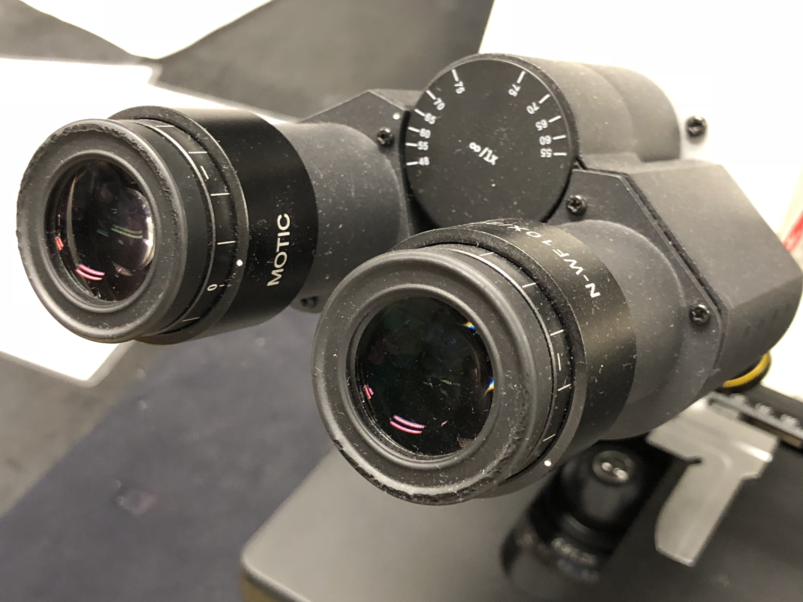
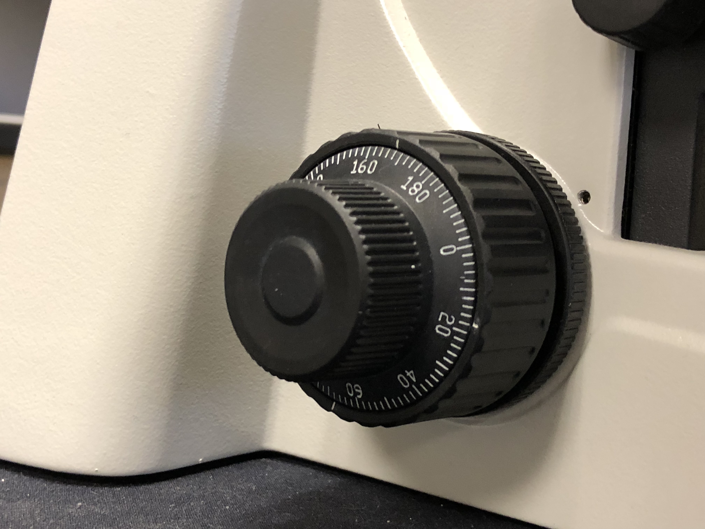

# The Microscope

In this laboratory session, you will be introduced to the microscope, its parts and its use. While you cannot practice to use the microscope in person, careful study of this chapter will make it easier to do so when you can come back to the lab eventually.

A [microscope](https://en.wikipedia.org/wiki/Microscope) (from the Ancient Greek: mikrós, "small" and skopeîn, "to look" or "see") is an instrument used to see objects that are too small to be seen by the naked eye. Microscopic means invisible to the eye unless aided by a microscope.

There are many types of microscopes, and they may be grouped in different ways. One way is to describe the way the instruments interact with a sample to create images, either by sending a beam of light or electrons to a sample in its optical path, or by scanning across, and a short distance from, the surface of a sample using a probe. The most common microscope (and the first to be invented) is the [optical microscope](https://en.wikipedia.org/wiki/Optical_microscope), which uses light to pass through a sample to produce an image.

The objective lens of a microscope (Figure \@ref(fig:objectives)) is a cylinder containing one or more lenses that are typically made of glass. It is essentially a high-powered magnifying glass which is brought very close to the specimen being examined. The objective collects light from the sample so that it comes to a focus inside the microscope tube. This creates an enlarged image of the specimen.

```{r objectives, fig.cap='The microscope objectives.', echo=FALSE, message=FALSE, warning=FALSE}
knitr::include_graphics("./figures/microscope/Microscope_objectives.jpg")
```

The eyepieces, or ocular lenses (Figure \@ref(fig:oculars)), are the lenses that are closest to your eyes when you look through the microscope. The objective lens or mirror collects light and brings it to focus creating an image. The eyepiece is placed near the focal point of the objective to magnify this image. This image is inverted and can be seen by removing the eyepiece and placing a piece of tracing paper over the end of the tube. By carefully focusing a brightly lit specimen, a highly enlarged image can be seen. It is this real image that is viewed by the eyepiece lens that provides further enlargement. The amount of magnification depends on the focal length of the eyepiece. The ocular in our microscopes have a 10× magnification.

```{r oculars, fig.cap='The oculars (eye pieces) of the microscope.', echo=FALSE, message=FALSE, warning=FALSE}

```

Our microscopes have four objective lenses with different magnifications, screwed into the circular "nosepiece" which you rotate to select the required lens. These lenses are color coded for easier use. The least powerful lens is called the scanning objective lens and is a 4× objective. The second lens is referred to as the small objective lens and is 10× lens. The most powerful lens out of the four are referred to as the large objective lenses and are 40× and 100×. The 100× objective is an oil-immersion lens. This objective is specially designed for use with refractive index matching oil, which must fill the gap between the objective lens and the specimen.

```{r focus, fig.cap='The coarse (big wheel) and fine (small wheel) focus adjustment knobs.', echo=FALSE, message=FALSE, warning=FALSE}

```

The stage is a platform below the objective which supports the specimen being viewed. Adjustment knobs (on the left side of the microscope) move the stage up and down with separate adjustment for coarse and fine focusing (Figure \@ref(fig:focus)). In the center of the stage is a hole through which light passes to illuminate the specimen (Figure \@ref(fig:stage)). The stage has arms to hold slides (rectangular glass plates on which the specimen is mounted).

```{r stage, fig.cap='The stage with the slide holder and central opening showing the condenser lens.', echo=FALSE, message=FALSE, warning=FALSE}
knitr::include_graphics("./figures/microscope/stage.jpg")
```

The stage moves up and down for focus. Always start with the lowest magnification in order to center the specimen on the stage. After moving to a higher magnification re-focus using the fine focus knob. You may also have to adjust the horizontal positions using the horizontal stage and slide holder adjustment knobs hanging down on the right side of the stage (Figure \@ref(fig:condenser)). Our microscopes, an adjustable LEDs light source (knob on the right side). The condenser is a lens designed to focus light from the illumination source onto the sample. The light source and condenser also each include a diaphragm to influence the quality and intensity of the illumination. For our purposes, the diaphragms should always be completely open. Adjust the light intensity only using the knob on the right side of the frame of the microscope (the black knob below the green switch in Figure \@ref(fig:stage).

```{r condenser, fig.cap='The condenser (below the stage), the horizontal stage and slide holder adjustment knobs (hanging down from the stage), the light on switch and light intensity adjustment knob (in the back).', echo=FALSE, message=FALSE, warning=FALSE}
knitr::include_graphics("./figures/microscope/condenser.jpg")
```

Now, please watch the [following video](https://youtu.be/SUo2fHZaZCU) and see how it compares to what you have just read:

<iframe width="560" height="315" src="https://www.youtube.com/embed/SUo2fHZaZCU" frameborder="0" allow="accelerometer; autoplay; encrypted-media; gyroscope; picture-in-picture" allowfullscreen></iframe>

## Elodea Leaf Wet Mount

[*Elodea canadensis*](https://en.wikipedia.org/wiki/Elodea_canadensis) (American or Canadian waterweed or pondweed) is a perennial aquatic plant, or submergent macrophyte, native to most of North America. It grows rapidly in favorable conditions and can choke shallow ponds, canals, and the margins of some slow-flowing rivers. It requires summer water temperatures of 10-25 °C and moderate to bright lighting.
Young plants initially start with a seedling stem with roots growing in mud at the bottom of the water; further adventitious roots are produced at intervals along the stem, which may hang free in the water or anchor into the bottom. It grows indefinitely at the stem tips, and single specimens may reach lengths of 3 m or more.
The leaves are bright green, translucent, oblong, 6-17 mm long and 1-4 mm broad, borne in whorls of three (rarely two or four) round the stem. It lives entirely underwater, the only exception being the small white or pale purple flowers which float at the surface and are attached to the plant by delicate stalks.
It is dioecious, with male and female flowers on different plants. The flowers have three small white petals; male flowers have 4.5-5 mm petals and nine stamens, female flowers have 2-3 mm petals and three fused carpels. The fruit is an ovoid capsule, about 6 mm long containing several seeds that ripen underwater. The seeds are 4-5 mm long, fusiform, glabrous (round), and narrowly cylindrical. It flowers from May to October.

### Experimental procedures
1.	Get a single leaf from the Elodea plant and mount it on a slide, cover it with a drop of water and a cover slip.
2.	Place the slide onto the microscope state and observe at the leaf under the microscope.
3.	These leaves are two cells thick, so you should be able to focus up and down to see that the cells in one layer are larger than those in the other. When one layer is in focus, you may be able to see the shadowy outlines of cell walls in the other layer.
4.	Notice that the cells are clearly delineated by the cell wall.
5.	Inside the cells are large oval-shaped green bodies, the chloroplasts.
6.	As the cells warm, you can see the chloroplasts carried by the moving cytoplasm around the nearly transparent nucleus in the center of the cell.
7.	Make a drawing of what you see at 400× magnification.

```{r elodea, fig.cap='Elodea leaf wet mount (4× objective).', echo=FALSE, message=FALSE, warning=FALSE}
knitr::include_graphics("./figures/microscope/elodea_leaf.jpg")
```

Now, please watch the [following video](https://youtu.be/UWbGZMO4o_U) and see how it compares to what you have just read:

<iframe width="560" height="315" src="https://www.youtube.com/embed/UWbGZMO4o_U" frameborder="0" allow="accelerometer; autoplay; encrypted-media; gyroscope; picture-in-picture" allowfullscreen ></iframe>

## Review Questions
1. Why do biologists use microscopes?
2. What is the function of the microscope objectives?
3. What are the magnification factors of the objectives of our microscopes?
4. What is the name of the lenses that are close to your eyes when you look through the microscope?
2. What is the magnifying power of these lenses?
3. What is the total magnification of the image that you observe if you use the 40× objective?
5. What is the difference between the action of the coarse and the fine focus knobs?
6. Which part of the microscope moves when you turn the focus knobs?
7. What is the field of view?
8. How does it change when you switch from a lower to a higher power objective?
