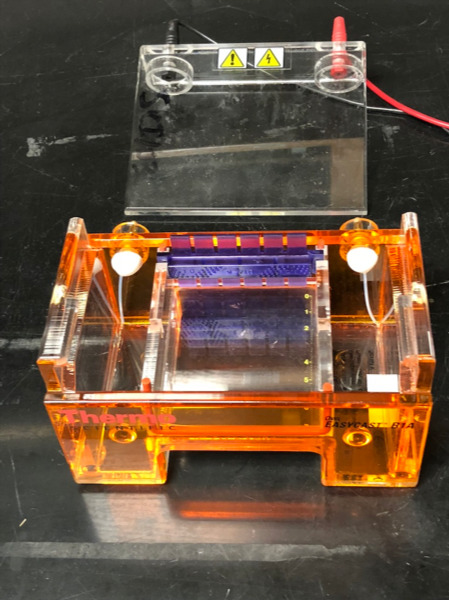
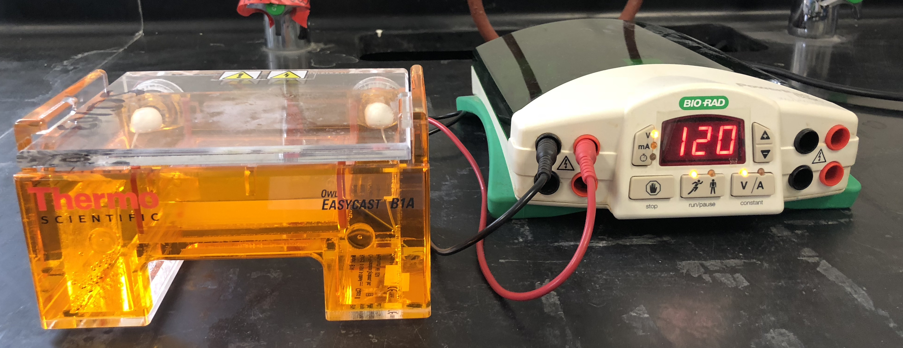
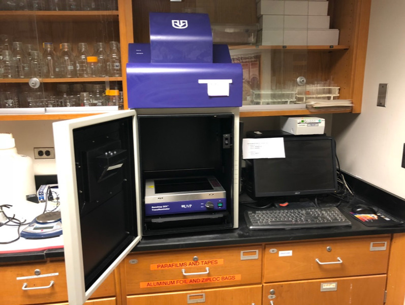

# Molecular Biology

[Molecular biology](https://en.wikipedia.org/wiki/Molecular_biology) concerns the molecular basis of biological activity between biomolecules in the various systems of a cell, including the interactions between DNA, RNA, and proteins and their biosynthesis, as well as the regulation of these interactions.

One of the most basic techniques of molecular biology to study protein function is molecular cloning. In this technique, DNA coding for a protein of interest is cloned using polymerase chain reaction (PCR), and/or restriction enzymes into a plasmid (expression vector). A vector has 3 distinctive features: an origin of replication, a multiple cloning site (MCS), and a selective marker usually antibiotic resistance. Located upstream of the multiple cloning site are the promoter regions and the transcription start site which regulate the expression of cloned gene. This plasmid can be inserted into either bacterial or animal cells. Introducing DNA into bacterial cells can be done by transformation via uptake of naked DNA, conjugation via cell-cell contact or by transduction via viral vector. Introducing DNA into eukaryotic cells, such as animal cells, by physical or chemical means is called transfection. Several different transfection techniques are available, such as calcium phosphate transfection, electroporation, microinjection and liposome transfection. The plasmid may be integrated into the genome, resulting in a stable transfection, or may remain independent of the genome, called transient transfection.

DNA coding for a protein of interest is now inside a cell, and the protein can now be expressed. A variety of systems, such as inducible promoters and specific cell-signaling factors, are available to help express the protein of interest at high levels. Large quantities of a protein can then be extracted from the bacterial or eukaryotic cell. The protein can be tested for enzymatic activity under a variety of situations, the protein may be crystallized so its tertiary structure can be studied, or, in the pharmaceutical industry, the activity of new drugs against the protein can be studied.

##  DNA restriction digest
[Lambda DNA](https://en.wikipedia.org/wiki/Lambda_phage) comes from a virus ([bacteriophage](https://en.wikipedia.org/wiki/Bacteriophage)) that infects bacteria. This virus does not infect humans and is therefore safe source to work with. Lambda DNA is approximately 48,000 base pairs long.

When restriction enzymes are used to cut DNA fragments of varying sizes are produced. Cut DNA can be separated using a process known as [agarose gel electrophoresis](https://en.wikipedia.org/wiki/Agarose_gel_electrophoresis).
Agarose gel electrophoresis separates DNA fragments by molecular weight. DNA fragments are loaded into an agarose gel slab, which is placed into a chamber filled with a conductive buffer solution. A direct current is passed between positive (red) and negative (black) wire electrodes at each end of the chamber. DNA fragments are negatively charged, and when placed in an electric field will be drawn toward the positive pole (red). The matrix of the agarose gel acts as a molecular sieve through which smaller DNA fragments can move more easily than larger ones. Therefore, the distance and rate at which DNA fragments migrate through the gel is inversely proportional to its molecular weight. Over a period of time smaller fragments will travel farther than larger ones. Fragments of the same size stay together and migrate in discrete "bands".

##  Preparing a gel for agarose gel electrophoresis
We will use gel electrophoresis to separate the DNA fragments obtained from the restriction digest (Figure \@ref(fig:box)). Before setting up the digest, we will pour agarose gel because it will take about half an hour for the gel to harden.

```{r box, fig.cap='Agarose gel box with comb in place, ready for gel to be poured.', echo=FALSE, message=FALSE, warning=FALSE}

```

### Experimental procedures
2.  Get the Erlenmeyer flask containing 0.5 g of agarose powder
3.  Add 50 ml of 1x TAE (Tris base, acetic acid, EDTA) running buffer.
4.  Add 5 µl of SybrGreen™ dye (10,000x stock solution).
5.  Heat in the microwave at full power for 1 minute.
6.  Swirl to make sure that all powder has dissolved, and the solution is clear.
7.  Add the comb into the comb slot.
8.  Pour the solution onto the gel tray in the gel box.

## Setting up the restriction digest reactions
In this experiment, we will use three [restriction enzymes](https://en.wikipedia.org/wiki/Restriction_enzyme) (EcoRI, Hind III, and Pst I) to cut Lambda DNA.

### Experimental procedures
1.  Digest DNA: microtubes that contain the enzyme stock solution, Lambda DNA, and restriction buffer are provided on ice (in an ice bucket).
1.	Get 4 new microtubes and label each as follows:
    *   Tube 1: L = Lambda DNA
    *   Tube 2: P = Pst I digest
    *   Tube 3: E = EcoRI digest
    *   Tube4: H = Hind III digest
1.	Use a new pipette tip for each transfer and pipet the reagents (from the stock solutions kept on ice) into each tube according to Table \@ref(tab:digest).
1.	Mix the components by gently flicking the tube with your finger. Pulse spin the tubes in the microcentrifuge to collect all the liquid to the bottom of the tube.
1.	Place the tubes in the heat block and incubate for 30 minutes at 37°C.

Table: (\#tab:digest) DNA digestion.

Tube  |DNA |buffer|Pst I|EcoR I|Hind III
|:---:|:--:|:----:|:---:|:----:|:------:|
L     |4 µl|6 µl  |	_   |	_	   |_       |
P     |4 µl|5 µl  |	1 µl|	_	   |_       |
E     |4 µl|5 µl  |	_	  |1 µl	 |_       |
H     |4 µl|5 µl  |	_	  |	_    |1 µl    |

##  Loading the DNA samples on the agarose gel and agarose gel electrophoresis
1.	Remove the digested DNA samples from the heat block.
2.	Pulse spin the tubes in the centrifuge to bring all of the liquid to the bottom of the tube.
2.	Add 2 µl of sample loading dye into each tube. Mix the contents by flicking the tube with your finger.
3.	Fill the electrophoresis chamber and cover the gel with 1x TAE running buffer (this will require   about 275 ml of buffer).
4.	Check that the wells of the agarose gels are near the black (-) electrode and the base of the gel is near the red (+) electrode.
5.	Load 12 µl of each sample into separate wells in the gel chamber in the following order:
    *   Lane 1:	L
    *   Lane 2:	P
    *   Lane 3:	E
    *   Lane 4:	H
    *   Lane 5: DNA size marker
6.	Place the lid on the electrophoresis chamber. Connect the electrical leads into the power supply, red to red and black to black.
7.	Turn on the power and run the gel at 120 V for 35 minutes (Figure \@ref(fig:power)).

```{r power, fig.cap='Gel electrophoresis box and power supply.', echo=FALSE, message=FALSE, warning=FALSE}

```

##  Visualizing the DNA fragments from the restriction digest
We added a non-toxic green fluorescent dye to the agarose before we poured the gel. The inclusion of this dye will allow us to visualize the separated DNA fragments by exposing the gel to UV light source in the UV light box (Figure \@ref(fig:doc)).

### Experimental procedures
1.  Visualize cut DNA using the UV light box (Figure \@ref(fig:doc)).
2.  Print out a picture of the gel.

```{r doc, fig.cap='Gel documentation system with UV light source.', echo=FALSE, message=FALSE, warning=FALSE}

```

## Review Questions
1. What is DNA made of?
1. What is a restriction enzyme?
2. What is a DNA ligase?
3. What is a DNA polymerase?
4. What is molecular cloning?
5. What is gel electrophoresis?
6. In an electric field, DNA moves from the `________` to the `_________` pole.
6. Smaller fragments of DNA move `_________` than larger fragments.
