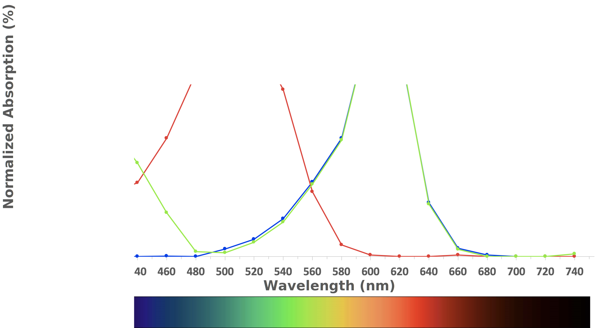

# Photosynthesis

In this lab, we will study the effect of light intensity and quality (wave length - color) on [photosynthesis](https://en.wikipedia.org/wiki/Photosynthesis). As a measure of the rate of photosynthesis, we will monitor the rate of oxygen production. When plants that spend their life submerged in water release oxygen it forms bubbles, which we can count over a period of time to determine photosynthesis rate.

Photosynthesis is a process used by plants and other organisms to convert light energy into chemical energy that can later be released to fuel the organisms' activities (energy transformation). This chemical energy is stored in carbohydrate molecules, such as sugars, which are synthesized from carbon dioxide and water - hence the name photosynthesis, from the Greek phōs, "light", and synthesis, "putting together".  In most cases, oxygen is also released as a waste product. Most plants, most algae, and cyanobacteria perform photosynthesis; such organisms are called photoautotrophs. Photosynthesis is largely responsible for producing and maintaining the oxygen content of the Earth's atmosphere, and supplies all of the organic compounds and most of the energy necessary for life on Earth.

Although photosynthesis is performed differently by different species, the process always begins when energy from light is absorbed by proteins called reaction centers that contain green chlorophyll pigments. In plants, these proteins are held inside organelles called chloroplasts, which are most abundant in leaf cells, while in bacteria they are embedded in the plasma membrane. In these light-dependent reactions, some energy is used to strip electrons from suitable substances, such as water, producing oxygen gas. The hydrogen freed by the splitting of water is used in the creation of two further compounds that act as an immediate energy storage means: reduced nicotinamide adenine dinucleotide phosphate (NADPH) and adenosine triphosphate (ATP), the "energy currency" of cells.

In plants, algae and cyanobacteria, long-term energy storage in the form of sugars is produced by a subsequent sequence of light-independent reactions called the Calvin cycle; some bacteria use different mechanisms, such as the reverse Krebs cycle, to achieve the same end. In the Calvin cycle, atmospheric carbon dioxide is incorporated into already existing organic carbon compounds, such as ribulose bisphosphate (RuBP). Using the ATP and NADPH produced by the light-dependent reactions, the resulting compounds are then reduced and removed to form further carbohydrates, such as glucose.

The first photosynthetic organisms probably evolved early in the evolutionary history of life and most likely used reducing agents such as hydrogen or hydrogen sulfide, rather than water, as sources of electrons. Cyanobacteria appeared later; the excess oxygen they produced contributed directly to the oxygenation of the Earth, which rendered the evolution of complex life possible. Today, the average rate of energy capture by photosynthesis globally is approximately 130 terawatts which is about three times the current power consumption of human civilization. Photosynthetic organisms also convert around 100-115 thousand million metric tons of carbon into biomass per year.

The main source of light on Earth is the Sun. Sunlight provides the energy that green plants use to create sugars mostly in the form of starches, which release energy into the living things that digest them. This process of photosynthesis provides virtually all the energy used by living things.
The primary properties of visible light are intensity, propagation direction, frequency or wavelength spectrum, and polarization, while its speed in a vacuum, 299,792,458 meters per second, is one of the fundamental constants of nature. Visible light, as with all types of electromagnetic radiation (EMR), is experimentally found to always move at this speed in a vacuum.

## Intensity of light
[Light](https://en.wikipedia.org/wiki/Light) is electromagnetic radiation within a certain portion of the electromagnetic spectrum (Figure \@ref(fig:spectrum)). The word usually refers to visible light, which is visible to the human eye and is responsible for the sense of sight. Visible light is usually defined as having wavelengths in the range of 400-700 nanometres (nm), or 400 x 10^-9^ to 700 x 10^-9^ m, between the infrared (with longer wavelengths) and the ultraviolet (with shorter wavelengths). This wavelength means a frequency range of roughly 430-750 terahertz (THz).

(ref:spectrum) [Spectrum of light. V, violet; B, blue; G, green Y, yellow; O, orange; R, red](https://commons.wikimedia.org/wiki/File:Linear_visible_spectrum.svg)

```{r spectrum, fig.cap='(ref:spectrum)', echo=FALSE, message=FALSE, warning=FALSE}
knitr::include_graphics("./figures/photosynthesis/spectrum.jpg")
```

In this experiment (Figure \@ref(fig:photosynthesis)), we will study the effect of light intensity on the photosynthetic activity of *Elodea canadensis*. We will vary the light intensity by changing the distance between the light source and the plant. We will count the emerging oxygen bubbles as an indicator of the photosynthetic activity of the plant.

```{r photosynthesis, fig.cap='Setup for photosynthesis experiment.', echo=FALSE, message=FALSE, warning=FALSE}

```

### Experimental procedures
1.  Select a fresh, crisp sprig of Elodea about 15 cm in length.
2.  While the plant is still submerged, cut 2-3 mm from its base.
3.  Place the sprig upside down in a test tube filled with 0.25% sodium bicarbonate. This is a buffer to absorb toxic materials evolved (i.e., that are released. Keeping the plant submerged, position a light source 1 foot away and adjust so the light shines directly on the plant.
4.  Place the test tube in a beaker of water as shown in Fig. \@ref(fig:photosynthesis) to prevent overheating the plant. Allow the system to stand 7-10 minutes, or until bubbles begin to appear regularly.
5.  Count the bubbles produced each minute for a 5-minute period and average them. Record your findings in the table.
6.  Move the light back 2 feet from the plant, wait 5 minutes, and repeat counting. Record your findings in Table \@ref(tab:intensity).
7.  Move the light back to 3 feet from the plant and repeat counting the bubbles.

Table: (\#tab:intensity) Intensity of light.

Distance of light source/Bubbles per minute|1  | 2  |   3| 4  | 5  |Average
|:-----------------------|:--|:---|:---|:---|:---|:-----:|
1 foot                   |   |    |    |    |    |       |
2 feet                   |   |    |    |    |    |       |
3 feet                   |   |    |    |    |    |       |

```{r bubbles, fig.cap='Appearance of bubbles indicates active photosynthesis.', echo=FALSE, message=FALSE, warning=FALSE}
	knitr::include_graphics("./figures/photosynthesis/photosynthesis_bubbles.jpg")
```


## Color of light
In this experiment, we will study the effect of the color of light on the photosynthetic activity of *Elodea canadensis*. We will use filter to expose the plant to light of only a limited range of wavelengths. We will again count the emerging oxygen bubbles as an indicator of the photosynthetic activity of the plant.

### Experimental procedures
1.	Select a fresh, crisp sprig of Elodea about 15 cm in length.
2.	While the plant is still submerged, cut 2-3 mm from its base.
3.	Place the sprig upside down in a test tube filled with 0.25% sodium bicarbonate. This is a buffer to absorb toxic materials evolved (i.e., that are released). Keeping the plant submerged, position a light source 1 foot away and adjust so the light shines directly on the plant.
4.	Place a colored filter between the test tube and the heat shield beaker and allow it to sit for 5 minutes.
5.	Count bubbles for 5 minutes as in the previous experiment. Record your findings in Table \@ref(tab:color). Repeat steps 1 and 2 for each color filter available.

Table: (\#tab:color) Color of light.

Color of filter/Bubbles per minute|1  | 2  |   3| 4  | 5 |Average
|:-----------------------|:--|:---|:---|:---|:---|:-----:|
| blue                   |   |    |    |    |    |       |
| orange                 |   |    |    |    |    |       |
| red                    |   |    |    |    |    |       |

## Determination of the light absorption spectrum of dye solutions

In this experiment, we will use a [spectrophotometer](https://en.wikipedia.org/wiki/Spectrophotometry) to measure the differential absorption of light of different wavelength by water stained with food dyes.

```{r spectrophotometer, fig.cap='Spectrophotometer and cuvettes with dye solutions.', echo=FALSE, message=FALSE, warning=FALSE}
	
```

### Experimental procedures
1.  Take six cuvettes.
2.  Fill one cuvette with water.
3.  Fill each of the remaining five cuvettes with one of the color solutions listed in Table \@ref(tab:absorption).
4.  Insert the cuvette with water into the slot marked "B".
5.  Insert the other cuvettes into the slots marked 1 to 5 and write down which color is in which slot.
6.  Following the instructions posted on the spectrophotometer, program the machine to take absorption measurements at wavelengths between 380-740 nm in 20 nm steps.
7.  Once the measurements are completed, write down the absorption number for each dye and wavelength.
8.  Use a spreadsheet program to graph your results.
9.  Compare your curves with the data shown in Figure \@ref(fig:absorption).

```{r cuvettes, fig.cap='Cuvettes placed in the spectrophotometer.', echo=FALSE, message=FALSE, warning=FALSE}
	knitr::include_graphics("./figures/photosynthesis/cuvettes.jpg")
```

Table: (\#tab:absorption) Determination of the light absorption spectrum of dye solutions.

|Wavelength (nm)|Purple|Blue |Green|Yellow|Red|
|:------------:|:-----|:----|:----|:-----|:---|
| 380          |      |     |     |      |    |
| 400          |      |     |     |      |    |
| 420          |      |     |     |      |    |
| ...          |      |     |     |      |    |
| 720          |      |     |     |      |    |
| 740          |      |     |     |      |    |

```{r absorption, fig.cap='Normalized absorption of red, green and blue dye solutions. Compare these data with your own results.', echo=FALSE, message=FALSE, warning=FALSE}
	
```

## Chromatography
[Chromatography](https://en.wikipedia.org/wiki/Chromatography) is a laboratory technique for the separation of a mixture. The mixture is dissolved in a fluid called the mobile phase, which carries it through a structure holding another material called the stationary phase. The various constituents of the mixture travel at different speeds, causing them to separate. The separation is based on differential partitioning between the mobile and stationary phases. Subtle differences in a compound's partition coefficient result in differential retention on the stationary phase and thus affect the separation.
Chromatography may be preparative or analytical. The purpose of preparative chromatography is to separate the components of a mixture for later use and is thus a form of purification. Analytical chromatography is done normally with smaller amounts of material and is for establishing the presence or measuring the relative proportions of analytes in a mixture.

In this experiment, we separate a mixture of food dyes (dark greenish liquid. The mobile phase (separation buffer) is 1% NaCl in water, the stationary phase is chromatography paper.

### Experimental procedures
1.  Obtain a small beaker.
2.  Add NaCl running buffer to the beaker until it reaches a height of  about 5 mm.
3.  Obtain a strip of chromatography paper and put it down on the bench.
4.  Obtain the bottle containing the dark green food dye mixture.
5.  Obtain a glass capillary and insert the tip of the capillary into the food dye mixture liquid. A little bit of dye will ascend into the capillary.
6.  Remove the capillary and apply.
7.  Touch the left side of the chromatography paper about 1 cm above its lower end with the tip of the capillary. A little bit of green liquid will spread out on the paper. Lift the capillary and touch the paper again just to the right of the dye you just applied.  Repeat this until you have a horizontal line of dye from the left to the right side of the paper.
8.  Place the chromatography paper into the beaker as shown below.
9.  Observe how the running buffer moves up the paper and separates the dye mixture into three components (red, yellow and blue.

```{r chromatography, fig.height='3', fig.cap='Result of the Chromatography experiment.', echo=FALSE, message=FALSE, warning=FALSE}
	knitr::include_graphics("./figures/photosynthesis/chromatography.jpg")
```

## Review Questions
1.  What is light?
2.  In your own words, describe the endproducts of photosynthesis.
3.  In your own words, describe what happens in photosynthesis.
4.  What is chlorophyll and what does it do?
5.  Where inside of plant cells does photosynthesis happen?
6.  What is chromatography and what is it used for?
