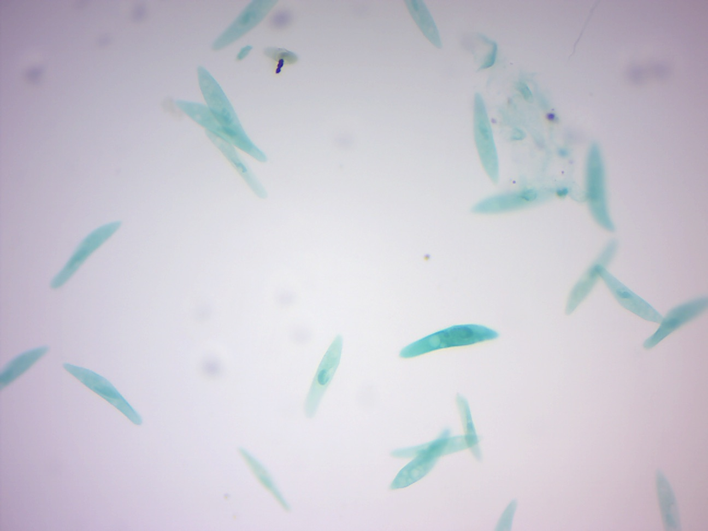
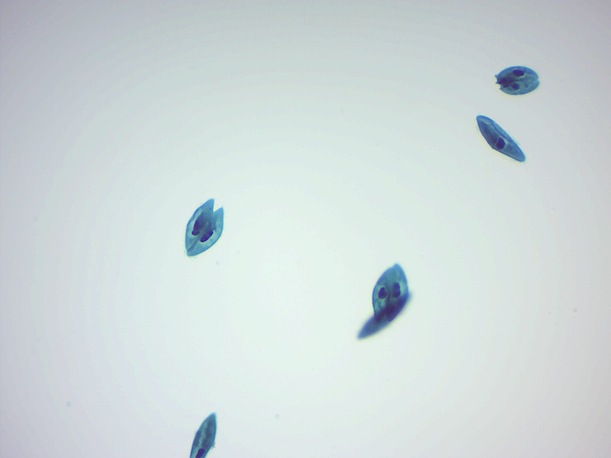

# Protista

[Protists](https://en.wikipedia.org/wiki/Protist) are any eukaryotic organism that are not an animal, plant or fungus. The protists do not form a natural group, or clade, but are often grouped together for convenience. In the popular five-kingdom scheme proposed by Robert Whittaker in 1969, the protists make up a kingdom called Protista, composed of "organisms which are unicellular or unicellular-colonial and which form no tissues.
Some protists are significant parasites of animals (e.g., five species of the parasitic genus Plasmodium cause malaria in humans and many others cause similar diseases in other vertebrates), plants (the oomycete Phytophthora infestans causes late blight in potatoes) or even of other protists. Protist pathogens share many metabolic pathways with their eukaryotic hosts. This makes therapeutic target development extremely difficult - a drug that harms a protist parasite is also likely to harm its animal/plant host.

The term protista was first used by Ernst Haeckel in 1866. Protists were traditionally subdivided into several groups based on similarities to the "higher" kingdoms such as:

* [Protozoa](https://en.wikipedia.org/wiki/Protozoa): the unicellular "animal-like" (heterotrophic/parasitic) protozoa which were further sub-divided based on motility such as (flagellated) Flagellata, (ciliated) Ciliophora (or Ciliata), (phagocytic) amoeba and spore-forming Sporozoans
* Protophyta: the "plant-like" (autotrophic) protophyta (mostly unicellular algae)
* Molds: the "fungus-like" (saprophytic) slime molds and water molds.

The taxonomy of protists is ever changing. Newer classifications attempt to present monophyletic groups based on morphological (especially ultrastructural), biochemical (chemotaxonomy) and DNA sequence (molecular research) information. However, there are sometimes discordances between molecular and morphological investigations.

##  View Living Organisms

###	Amoeba proteus
[*Amoeba proteus*](https://en.wikipedia.org/wiki/Amoeba_proteus) (Figure \@ref(fig:amoeba)) is an amoeba closely related to the giant amoebae. This small protozoan uses tentacular protuberances called pseudopodia to move and phagocytose smaller unicellular organisms, (which may be greater in size than of amoeba), which are enveloped inside the cell's cytoplasm in a food vacuole, where they are slowly broken down by enzymes. It occupies freshwater environments and feeds on other protozoans, algae, rotifers, and even other smaller amoebae. Due to phytochromes, A. proteus may appear in a variety of colors (often yellow, green and purple) under a microscope.

```{r amoeba, fig.cap='Amoeba proteus.', echo=FALSE, message=FALSE, warning=FALSE}
knitr::include_graphics("./figures/protists/Amoeba_proteus.jpg")
```

###	Paramecium caudatum
[*Paramecium caudatum*](https://en.wikipedia.org/wiki/Paramecium_caudatum) (Figure \@ref(fig:paramecium)) is a unicellular, ciliate eukaryote. They can reach 0.25mm in length and are covered with minute hair-like organelles called cilia. The cilia are used in locomotion and feeding. P. caudatum feed on bacteria and small eukaryotic cells, such as yeast and flagellate algae. In hypotonic conditions (freshwater), the cell absorbs water by osmosis. It regulates osmotic pressure with the help of bladder-like contractile vacuoles, gathering internal water through its star-shaped radial canals and expelling the excess through the plasma membrane. When moving through the water, they follow a spiral path while rotating on the long axis.
Paramecium have two nuclei (a large macronucleus and a single compact micronucleus). They cannot survive without the macronucleus and cannot reproduce without the micro-nucleus. Like all ciliates, Paramecia reproduce asexually, by binary fission. During reproduction, the macronucleus splits by a type of amitosis, and the micronuclei undergo mitosis. The cell then divides transversally, and each new cell obtains a copy of the micronucleus and the macronucleus.
Fission may occur as part of the normal vegetative cell cycle. Under certain conditions, it may be preceded by self-fertilization (autogamy), or it may follow conjugation, a sexual phenomenon in which Paramecia of compatible mating types fuse temporarily and exchange genetic material. During conjugation, the micronuclei of each conjugant divide by meiosis and the haploid gametes pass from one cell to the other. The gametes of each organism then fuse to form diploid micronuclei. The old macronuclei are destroyed, and new ones are developed from the new micronuclei. Without the rejuvenating effects of autogamy or conjugation a Paramecium ages and dies. Only opposite mating types, or genetically compatible organisms, can unite in conjugation.

```{r paramecium, fig.cap='Paramecium caudatum.', echo=FALSE, message=FALSE, warning=FALSE}
knitr::include_graphics("./figures/protists/Paramecium_caudatum.jpg")
```

###	Euglena
[*Euglena*](https://en.wikipedia.org/wiki/Euglena) (Figure \@ref(fig:euglena)) is a genus of single-celled flagellate eukaryotes. It is the best known and most widely studied member of the class Euglenoidea, a diverse group containing some 54 genera and at least 800 species. Species of Euglena are found in fresh and salt waters. They are often abundant in quiet inland waters where they may bloom in numbers sufficient to color the surface of ponds and ditches green (E. viridis) or red (E. sanguinea).
When feeding as a heterotroph, Euglena takes in nutrients by osmotrophy, and can survive without light on a diet of organic matter, such as beef extract, peptone, acetate, ethanol or carbohydrates. When there is sufficient sunlight for it to feed by phototrophy, it uses chloroplasts containing the pigments chlorophyll a and chlorophyll b to produce sugars by photosynthesis. Euglena's chloroplasts are surrounded by three membranes, while those of plants and the green algae (among which earlier taxonomists often placed Euglena) have only two membranes. This fact has been taken as morphological evidence that Euglena's chloroplasts evolved from a eukaryotic green alga. Thus, the intriguing similarities between Euglena and the plants would have arisen not because of kinship but because of a secondary endosymbiosis. Molecular phylogenetic analysis has lent support to this hypothesis, and it is now generally accepted.

```{r euglena, fig.cap='Euglena.', echo=FALSE, message=FALSE, warning=FALSE}
knitr::include_graphics("./figures/protists/euglena.jpg")
```

###	Peranema
[*Peranema*](https://en.wikipedia.org/wiki/Peranema) (Figure \@ref(fig:peranema)) is a genus of free-living flagellate, with more than 20 accepted species, varying in size between 8 and 200 micrometers. They are found in freshwater lakes, ponds and ditches, and are often abundant at the bottom of stagnant pools rich in decaying organic material. Although they belong to the class Euglenoidea, and are morphologically similar to the green Euglena, Peranema have no chloroplasts, and cannot feed by autotrophy. Instead, they capture live prey, such as yeast, bacteria and other flagellates, consuming them with the help of a rigid feeding apparatus called a "rod-organ." Unlike the green Euglenids, they lack both an eyespot (stigma), and the paraflagellar body (photoreceptor) that is normally coupled with that organelle. However, while Peranema lack a localized photoreceptor, they do possess the light-sensitive protein rhodopsin, and respond to changes in light with a characteristic "curling behavior."

```{r peranema, fig.cap='Peranema.', echo=FALSE, message=FALSE, warning=FALSE}
knitr::include_graphics("./figures/protists/peranema.jpg")
```

###	Chlamydomonas
[*Chlamydomonas*](https://en.wikipedia.org/wiki/Chlamydomonas) (Figure \@ref(fig:chlamydomonaslive)) is a genus of green algae consisting of unicellular flagellates, found in stagnant water and on damp soil, in freshwater, seawater, and even in snow as "snow algae". Chlamydomonas is used as a model organism for molecular biology, especially studies of flagellar motility and chloroplast dynamics, biogeneses, and genetics. One of the many striking features of Chlamydomonas is that it contains ion channels, (channelrhodopsins), that are directly activated by light. These proteins are used in optogenetics.

```{r chlamydomonaslive, fig.cap='Chlamydomonas. Note the flagella.', echo=FALSE, message=FALSE, warning=FALSE}

```

###	Gymnodinium
[*Gymnodinium*](https://en.wikipedia.org/wiki/Gymnodinium) is a genus of [dinoflagellates](https://en.wikipedia.org/wiki/Dinoflagellate) It is one of the few naked dinoflagellates, or species lacking armor (cellulosic plates). The dinoflagellates (Greek dinos "whirling" and Latin flagellum "whip, scourge") are a large group of flagellate eukaryotes that constitute the phylum Dinoflagellata. Most are marine plankton, but they are common in freshwater habitats, as well. Their populations are distributed depending on temperature, salinity, or depth. Many dinoflagellates are known to be photosynthetic, but a large fraction of these are in fact mixotrophic, combining photosynthesis with ingestion of prey (phagotrophy). In terms of number of species, dinoflagellates form one of the largest groups of marine eukaryotes, although this group is substantially smaller than the diatoms. Some species are endosymbionts of marine animals and play an important part in the biology of coral reefs. Other dinoflagellates are unpigmented predators on other protozoa, and a few forms are parasitic.

###	Pandorina
[*Pandorina*](https://en.wikipedia.org/wiki/Pandorina) (Figure \@ref(fig:pandorina)) is a genus of green algae composed of 8, 16, or sometimes 32 cells, held together at their bases to form a sack globular colony surrounded by mucilage. The cells are ovoid or slightly narrowed at one end to appear keystone- or pear-shaped. Each cell has two flagella with two contractile vacuoles at their base, an eyespot, and a large cup-shaped chloroplast with at least one pyrenoid. The colonies co-ordinate their flagellar movement to create a rolling, swimming motion. Pandorina shows the beginnings of the colony polarity and differentiation seen in Volvox since the anterior cells have larger eyespots. Asexual reproduction is by simultaneous division of all cells of the colony to form autocolonies that are liberated by a gelatinization of the colonial envelope. Sexual reproduction occurs by division of each cell of the colony into 16-32 zoogametes. Zoogametes show indications of heterogamy, a slight difference in the size and motility of the pairs that fuse to form the smooth walled zygote.

```{r pandorina, fig.cap='Pandorina.', echo=FALSE, message=FALSE, warning=FALSE}
knitr::include_graphics("./figures/protists/Pandorina.jpg")
```

###	Volvox
[*Volvox*](https://en.wikipedia.org/wiki/Volvox) (Figure \@ref(fig:volvox)) is a genus of freshwater algae found in ponds and ditches, even in shallow puddles. It forms spherical colonies of up to 50,000 cells that were first reported by Antonie van Leeuwenhoek in 1700. Volvox diverged from unicellular ancestors approximately 200 million years ago. Each mature Volvox colony is composed of up to thousands of cells from two differentiated cell types: numerous flagellate somatic cells and a smaller number of germ cells lacking in soma that are embedded in the surface of a hollow sphere or coenobium containing an extracellular matrix made of glycoproteins. Adult somatic cells comprise a single layer with the flagella facing outward. The cells swim in a coordinated fashion, with distinct anterior and posterior poles. The cells have anterior eyespots that enable the colony to swim towards light. An asexual colony includes both somatic (vegetative) cells, which do not reproduce, and large, non-motile gonidia in the interior, which produce new colonies through repeated division. In sexual reproduction two types of gametes are produced. Volvox species can be monoecious or dioecious. Male colonies release numerous sperm packets, while in female colonies single cells enlarge to become oogametes, or eggs.
Volvox is facultatively sexual and can reproduce both sexually and asexually. The switch from asexual to sexual reproduction can be triggered by environmental conditions and by the production of a sex-inducing pheremone. Desiccation-resistant diploid zygotes are produced following successful fertilization.

```{r volvox, fig.cap='Volvox.', echo=FALSE, message=FALSE, warning=FALSE}
knitr::include_graphics("./figures/protists/Volvox.jpg")
```

###	Oedogonium
[*Oedogonium*](https://en.wikipedia.org/wiki/Oedogonium) (Figure \@ref(fig:oedogonium)) is a genus of filamentous green algae, with unbranched filaments that are one cell thick. Oedogonium can be free-floating, though it is usually attached to aquatic plants by a holdfast. It appears greenish and inhabits calm, fresh water. Oedogonium can reproduce asexually by fragmentation of the filaments, through some other types of non-motile spores, and also through zoospores, which have many flagella. These develop in a zoosporangium cell, one zoospore per zoosporangium. After settling and losing its flagella, a zoospore grows into a filament. Oedogonium can also reproduce sexually. Its sexual life cycle is haplontic, i.e., the zygote undergoes meiosis. Antheridia produce and release sperm, and oogonia produce and release an egg,. The egg and sperm then fuse and form a zygote which is diploid (2n). The zygote then undergoes meiosis to produce the filamentous green alga which is haploid (1n).

```{r oedogonium, fig.cap='Oedogonium.', echo=FALSE, message=FALSE, warning=FALSE}
knitr::include_graphics("./figures/protists/oedogonium.jpg")
```

###	Spirogyra
[*Spirogyra*](https://en.wikipedia.org/wiki/Spirogyra) (Figure \@ref(fig:spiro); common names include water silk, mermaid's tresses, and blanket weed) is a genus of filamentous chlorophyte green algae of the order Zygnematales, named for the helical or spiral arrangement of the chloroplasts that is diagnostic of the genus. It is commonly found in freshwater areas, and there are more than 400 species of Spirogyra in the world. Spirogyra measures approximately 10 to 100 μm in width and may grow to several centimeters in length. Spirogyra can reproduce both sexually and asexually. In vegetative reproduction, fragmentation takes place, and Spirogyra simply undergoes the intercalary mitosis to form new filaments. Sexual Reproduction is of two types:
1. Scalariform conjugation requires association of two different filaments lined side by side either partially or throughout their length. One cell each from opposite lined filaments emits tubular protuberances known as conjugation tubes, which elongate and fuse, to make a passage called the conjugation canal. The cytoplasm of the cell acting as the male travels through this tube and fuses with the female cytoplasm, and the gametes fuse to form a zygospore.
2. In lateral conjugation, gametes are formed in a single filament. Two adjoining cells near the common transverse wall give out protuberances known as conjugation tubes, which further form the conjugation canal upon contact. The male cytoplasm migrates through the conjugation canal, fusing with the female. The rest of the process proceeds as in scalariform conjugation.
The essential difference is that scalariform conjugation occurs between two filaments and lateral conjugation occurs between two adjacent cells on the same filament.

```{r spiro, fig.cap='Spirogyra.', echo=FALSE, message=FALSE, warning=FALSE}
knitr::include_graphics("./figures/protists/Spirogyra.jpg")
```

##  View Prepared Slides

###	Amoeba proteus (Figure \@ref(fig:amoebaprepared))

```{r amoebaprepared, fig.cap='Amoeba proteus.', echo=FALSE, message=FALSE, warning=FALSE}
knitr::include_graphics("./figures/protists/Amoeba_proteus_prepared.jpg")
```

###	Paramecium 4 types of protista (Figure \@ref(fig:fourtypes))

```{r fourtypes, fig.cap='Paramecia and other protists.', echo=FALSE, message=FALSE, warning=FALSE}

```

###	Paramecium caudatum (Figure \@ref(fig:parameciumprepared))

```{r parameciumprepared, fig.cap='Paramecium.', echo=FALSE, message=FALSE, warning=FALSE}

```

###	Paramecium in conjugation (Figure \@ref(fig:conjugation))

```{r conjugation, fig.cap='Paramecium in conjugation.', echo=FALSE, message=FALSE, warning=FALSE}

```

###	Euglena (Figure \@ref(fig:euglenaprepared))

```{r euglenaprepared, fig.cap='Euglena.', echo=FALSE, message=FALSE, warning=FALSE}

```

###	Dinoflagellate (Figure \@ref(fig:dinoflagellateprepared))

```{r dinoflagellateprepared, fig.cap='Dinoflagellates.', echo=FALSE, message=FALSE, warning=FALSE}

```


###	Ceratium (Figure \@ref(fig:ceratium))

```{r ceratium, fig.cap='Ceratium, a dinoflagellate.', echo=FALSE, message=FALSE, warning=FALSE}
knitr::include_graphics("./figures/protists/ceratium.jpg")
```

###	Peridinium (Figure \@ref(fig:peridinium))

```{r peridinium, fig.cap='Peridinium, a dinoflagellate.', echo=FALSE, message=FALSE, warning=FALSE}
knitr::include_graphics("./figures/protists/Peridinium.jpg")
```

###	Foraminifera
[*Foraminifera*](https://en.wikipedia.org/wiki/Foraminifera) (Figure \@ref(fig:foraminifera); Latin meaning hole bearers; informally called "forams") are members of a phylum or class of amoeboid protists characterized by: streaming granular ectoplasm for catching food and other uses; and commonly an external shell (called a "test") of diverse forms and materials. Most foraminifera are marine, the majority of which live on or within the seafloor sediment (i.e., are benthic), while a smaller variety float in the water column at various depths (i.e., are planktonic). These shells are commonly made of calcium carbonate (CaCO~3~) or agglutinated sediment particles. Over 50,000 species are recognized, both living (10,000) and fossil (40,000).

```{r foraminifera, fig.cap='Foraminifera.', echo=FALSE, message=FALSE, warning=FALSE}

```

###	Radiolaria
[*Radiolaria*](https://en.wikipedia.org/wiki/Radiolaria) (Figure \@ref(fig:radiolaria)), also called Radiozoa, are protozoa of diameter 0.1-0.2 mm that produce intricate mineral skeletons, typically with a central capsule dividing the cell into the inner and outer portions of endoplasm and ectoplasm.The elaborate mineral skeleton is usually made of silica. They are found as zooplankton throughout the ocean, and their skeletal remains make up a large part of the cover of the ocean floor as siliceous ooze.

```{r radiolaria, fig.cap='Radiolaria.', echo=FALSE, message=FALSE, warning=FALSE}
knitr::include_graphics("./figures/protists/radiolaria.jpg")
```

###	Diatoms
[*Diatoms*](https://en.wikipedia.org/wiki/Diatom) (Figure \@ref(fig:diatomes)) are a major group of microalgae and are among the most common types of phytoplankton. Diatoms are producers within the food chain. A unique feature of diatom cells is that they are enclosed within a cell wall made of silica (hydrated silicon dioxide) called a frustule. These frustules show a wide diversity in form, but are usually almost bilaterally symmetrical, hence the group name. These shells are used by humans as diatomaceous earth, also known as diatomite. Fossil evidence suggests that they originated during, or before, the early Jurassic period. Only male gametes of centric diatoms are capable of movement by means of flagella. Diatom communities are a popular tool for monitoring environmental conditions, past and present, and are commonly used in studies of water quality.

```{r diatomes, fig.cap='Diatomes.', echo=FALSE, message=FALSE, warning=FALSE}

```

###	*Trypanosoma cruzi* and *Trypanosoma brucei gambiense*
[*Trypanosoma cruzi*](https://en.wikipedia.org/wiki/Trypanosoma_cruzi) is a species of parasitic euglenoids. Amongst the protozoa, the trypanosomes characteristically bore tissue in another organism and feed on blood (primarily) and also lymph. This behaviour causes disease or the likelihood of disease that varies with the organism: for example, trypanosomiasis in humans (Chagas disease in South America). Parasites need a host body and the haematophagous insect triatomine (descriptions "assassin bug", "cone-nose bug", and "kissing bug") is the major vector in accord with a mechanism of infection. The triatomine likes the nests of vertebrate animals for shelter, where it bites and sucks blood for food. Individual triatomines infected with protozoa from other contact with animals transmit trypanosomes when the triatomine deposits its faeces on the host's skin surface and then bites. Penetration of the infected faeces is further facilitated by the scratching of the bite area by the human or animal host.

[*Trypanosoma brucei*](https://en.wikipedia.org/wiki/Trypanosoma_brucei) (Figure \@ref(fig:gambiense)) is a species of parasitic kinetoplastid belonging to the genus Trypanosoma. The parasite is the cause of a vector-borne disease of vertebrate animals, including humans, carried by genera of tsetse fly in sub-Saharan Africa. In humans *T. brucei* causes African trypanosomiasis, or sleeping sickness. In animals it causes animal trypanosomiasis, also called nagana in cattle and horses. *T. brucei* has traditionally been grouped into three subspecies: *T. b. brucei*, *T. b. gambiense* and *T. b. rhodesiense*. The first is a parasite of non-human vertebrates, while the latter two are the known parasites of humans.

```{r gambiense, fig.cap='Trypanosoma brucei gambiense among red blood cells.', echo=FALSE, message=FALSE, warning=FALSE}

```

###	Plasmodium vivax
[*Plasmodium vivax*](https://en.wikipedia.org/wiki/Plasmodium_vivax) (Figure \@ref(fig:plasmodium)) is a protozoal parasite and a human pathogen. This parasite is the most frequent and widely distributed cause of recurring (benign tertian) malaria, P. vivax is one of the five species of malaria parasites that commonly infect humans. Although it is less virulent than Plasmodium falciparum, the deadliest of the five human malaria parasites, P. vivax malaria infections can lead to severe disease and death, often due to a pathologically enlarged spleen.  P. vivax is carried by the female Anopheles mosquito, since it is only the female of the species that bites.

```{r plasmodium, fig.cap='Plasmodium vivax merozoites and trophozoites (ring stage).', echo=FALSE, message=FALSE, warning=FALSE}

```

###	Mixed green algae (Figure \@ref(fig:mixedalgae))

```{r mixedalgae, fig.cap='Various green algae.', echo=FALSE, message=FALSE, warning=FALSE}
knitr::include_graphics("./figures/protists/Mixed_green_algae.jpg")
```

###	Chlamydomonas (Figure \@ref(fig:chlamydomonas))

```{r chlamydomonas, fig.cap='Chlamydomonas. Note the flagella.', echo=FALSE, message=FALSE, warning=FALSE}
knitr::include_graphics("./figures/protists/chlamydomonas.jpg")
```

###	Pandorina (Figure \@ref(fig:pandorinadead))

```{r pandorinadead, fig.cap='Pandorina.', echo=FALSE, message=FALSE, warning=FALSE}
knitr::include_graphics("./figures/protists/pandorinadead.jpg")
```

###	Volvox (Figure \@ref(fig:volvoxdead))

```{r volvoxdead, fig.cap='Volvox.', echo=FALSE, message=FALSE, warning=FALSE}
knitr::include_graphics("./figures/protists/volvox_dead.jpg")
```

###	Volvox sexual stages (Figure \@ref(fig:volvoxsex))

```{r volvoxsex, fig.cap='Volvox sexual stages.', echo=FALSE, message=FALSE, warning=FALSE}

```

###	Spirogyra (Figure \@ref(fig:spirogyraprepared))

```{r spirogyraprepared, fig.cap='Spirogyra.', echo=FALSE, message=FALSE, warning=FALSE}

```

###	Oedogonium zoospores (Figure \@ref(fig:oedogoniumzoospores)

```{r oedogoniumzoospores, fig.cap='Oedogonium zoospores.', echo=FALSE, message=FALSE, warning=FALSE}
knitr::include_graphics("./figures/protists/Oedogonium_zoospore_formation.jpg")
```

###	Oedogonium macrandous (Figure \@ref(fig:oedogoniumprepared))

```{r oedogoniumprepared, fig.cap='Oedogonium.', echo=FALSE, message=FALSE, warning=FALSE}
knitr::include_graphics("./figures/protists/Oedogonium_macrandrous.jpg")
```

###	Fucus male and female conceptacle
[*Fucus*](https://en.wikipedia.org/wiki/Fucus) is a genus of brown algae found in the intertidal zones of rocky seashores almost throughout the world. It has a relatively simple life cycle and produce only one type of thallus which grows to a maximum size of 2 m.
The thallus is perennial with an irregular or disc-shaped holdfast or with haptera. The erect portion of the thallus is dichotomous or subpinnately branched, flattened and with a distinct midrib. Gas-filled pneumatocysts (air-vesicles) are present in pairs in some species, one on either side of the midrib. The gametangia develop in conceptacles embedded in receptacles in the apices of the final branches. They may be monoecious or dioecious.
Fertile cavities, the conceptacles, containing the reproductive cells are immersed in the receptacles near the ends of the branches. After meiosis oogonia and antheridia are produced and released, fertilisation follows and the zygote develops directly into the diploid plant. It may be considered to be analogous to the life cycle of the flowering plant, but in algae the oogonia are released and fertilised in the sea while in flowering plants the ovules are fertilised while attached to the parent plant and then released as a seed.


###	Fucus male conceptacle (Figure \@ref(fig:malefucus))

```{r malefucus, fig.cap='Fucus male conceptacle', echo=FALSE, message=FALSE, warning=FALSE}

```

###	Fucus female conceptacle (Figure \@ref(fig:femalefucus))

```{r femalefucus, fig.cap='Fucus female conceptacle', echo=FALSE, message=FALSE, warning=FALSE}

```

###	*Polysiphonia*
[*Polysiphonia*](https://en.wikipedia.org/wiki/Polysiphonia) (Figure \@ref(fig:polysiphonia))
is a genus of filamentous red algae with about 19 species on the coasts of the British Isles and about 200 species worldwide.

```{r polysiphonia, fig.cap='Polysiphonia.', echo=FALSE, message=FALSE, warning=FALSE}
knitr::include_graphics("./figures/protists/Polysiphonia_prepared.jpg")
```

###	*Stemonitis*
[*Stemonitis*](https://en.wikipedia.org/wiki/Stemonitis) (Figure \@ref(fig:stemonitis)) is a distinctive genus of slime moulds found throughout the world (except Antarctica). They are characterized by the tall brown sporangia, supported on slender stalks, which grow in clusters on rotting wood.

```{r stemonitis, fig.cap='Stemonitis.', echo=FALSE, message=FALSE, warning=FALSE}
knitr::include_graphics("./figures/protists/stemonitis.jpg")
```

###	*Saprolegnia*
[*Saprolegnia*](https://en.wikipedia.org/wiki/Saprolegnia) (Figure \@ref(fig:saprolegnia)) is both a saprotroph and necrotroph. Typically feeding on waste from fish or other dead cells, they will also take advantage of creatures that have been injured. An infection is known as oomycosis Saprolegnia is tolerant to a wide range of temperature, 3 °C to 33 °C, but is more prevalent in lower temperatures. While it is found most frequently in freshwater, it will also tolerate brackish water and even moist soil. Saprolegnia filaments (hyphae) are long with rounded ends, containing the zoospores. Saprolegnia generally travels in colonies consisting of one or more species. They first form a mass of individual hyphae. When the mass of hyphae grows large enough in size to be seen without use of a microscope, it can be called a mycelium.

```{r saprolegnia, fig.cap='Saprolegnia.', echo=FALSE, message=FALSE, warning=FALSE}

```

It has a diploid life cycle which includes both sexual and asexual reproduction. In the asexual phase, a spore of Saprolegnia releases zoospores. Within a few minutes, this zoospore will encyst, germinate and release another zoospore. This second zoospore has a longer cycle during which most dispersal happens; it will continue to encyst and release a new spore in a process called polyplanetism until it finds a suitable substrate. When a suitable medium is located, the hairs surrounding the spore will lock onto the substrate so that the sexual reproduction phase can start. It is also during this stage of polyplanetism that the Saprolegnia are capable of causing infection; the most pathogenic species have tiny hooks at the end of their hairs to enhance their infectious ability. Once firmly attached, sexual reproduction begins with the production of male and female gametangium, antheridia and oogonium respectively. These unite and fuse together via fertilization tubes. The zygote produced is named an oospore.

## Review Questions
1. What are protists?
2. What are ciliata?
3. What are flagellata?
4. How do amoeba move?
5. What are slime molds?
